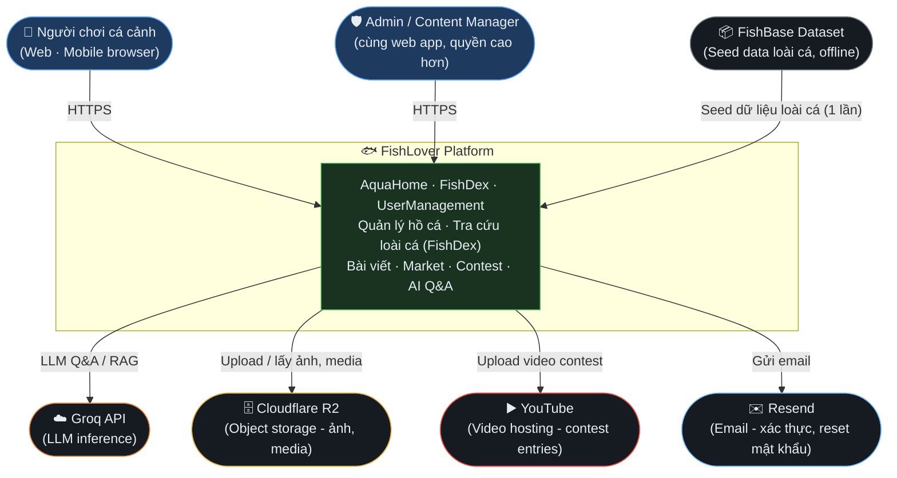

[← Về danh sách (00)](./00-overview.html)

# FishLover — C4 Level 1: System Context

> Cập nhật: 2026-09-29 · Phản ánh kiến trúc v2.0 (BackEndProject: ApiGateway + AquaHome + FishDex + UserManagement; FE: aquahome-web)

## Diagram

## Actors

| Actor | Mô tả |
|---|---|
| Người chơi cá cảnh | End user chính, dùng qua web app (mobile-first, iPhone 12+) — quản lý hồ cá, tra loài cá, đọc bài viết, tham gia contest, hỏi đáp AI |
| Admin / Content Manager | Cùng web app, quyền cao hơn — duyệt bài viết (`AdminArticlesController`), quản lý contest/sponsor |

## External Systems

| System | Vai trò | Dùng bởi service nào (nội bộ) |
|---|---|---|
| Groq API | LLM inference cho tính năng AI Q&A/RAG. Rate limit 30 RPM, fallback nội bộ sang Ollama Gemma 2B (self-hosted trên VM3) khi Groq down >5 phút | AquaHome BFF → VM3 embedding service |
| Cloudflare R2 | Object storage (S3-compatible) — ảnh species, ảnh hồ cá, snapshot, media contest | AquaHome, FishDex (`S3StorageService`) |
| YouTube | Lưu trữ & phát video contest entries | AquaHome (`YouTubeUploadService`) |
| Resend | Email provider — xác thực tài khoản, reset mật khẩu | UserManagement (`ResendEmailProvider`) |
| FishBase Dataset | Nguồn dữ liệu gốc (Parquet) để seed database loài cá — chỉ chạy 1 lần / khi cập nhật data, không phải runtime dependency | FishDex (`FishBaseFlattener`) |

## Ghi chú phạm vi (không vẽ ở Level 1)

- **Hạ tầng deploy** (Cloudflare Pages cho FE, Oracle VM1/VM2/VM3, Docker) — thuộc Deployment/Container view, không phải Context.
- **Monitoring stack** (Prometheus/Loki/Grafana trên VM2) — là internal ops tooling, không phải actor hay external system mà user tương tác.
- **Ollama (self-hosted)** — là fallback nội bộ của AI stack (chạy trên VM3), không phải third-party bên ngoài nên gộp vào box "FishLover Platform", không tách riêng ở Context level.
- **Notion** — công cụ quản lý task nội bộ team, không phải runtime dependency của hệ thống đang chạy.

Chi tiết bên trong "FishLover Platform" (SPA, API Gateway, 3 service BE, database, cache, AI services) nằm ở [Level 2 — Container](./02-container.md). Container nào chạy trên máy chủ nào xem [Deployment](./deployment.md).
