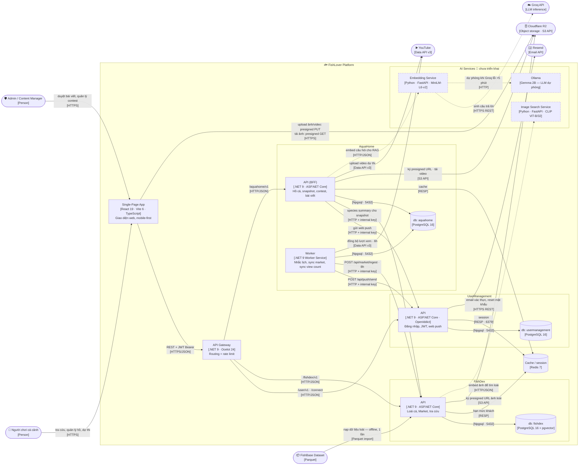

[← Về danh sách (00)](./00-overview.html)

# FishLover — C4 Level 2: Container

> Cập nhật: 2026-10-01 · Bóc tách box "FishLover Platform" ở [Level 1](./01-system-context.md).
>
> Boundary ở đây là **hệ thống phần mềm**, không phải máy chủ. Container nào chạy trên VM nào xem [Deployment](./deployment.md).

## Diagram

## Legend

| Ký hiệu | Nghĩa |
|---|---|
| Nét liền | Quan hệ **đang chạy thật** trên production |
| Nét đứt + 🚧 | **Chưa triển khai** — kiến trúc đích, chưa có code chạy |
| `[...]` trong nhãn | Technology / giao thức |
| Hình trụ | Data store |
| Hình bo tròn ngoài khung | Person hoặc external system (ngoài tầm kiểm soát của dự án) |

Chỉ có **hai** kiểu đường: liền = live, đứt = planned. Quan hệ nạp dữ liệu FishBase tuy chạy offline một lần vẫn vẽ nét liền vì nó đã thực sự chạy — tính chất "một lần" ghi trong nhãn chứ không mã hoá bằng kiểu nét.

## Container catalog

| Container | Technology | Trách nhiệm |
|---|---|---|
| Single-Page App | React 19 · Vite 6 · TypeScript 5.6 | Toàn bộ giao diện (mobile-first, iPhone 12+). Upload/tải media trực tiếp với R2 qua presigned URL |
| API Gateway | .NET 9 · Ocelot 24 | Điểm vào duy nhất của API. Route `/user/v1`, `/fishdex/v1`, `/aquahome/v1` + rate limit 20–60 req/phút tuỳ route |
| UserManagement API | .NET 9 · ASP.NET Core · OpenIddict · Identity | OAuth2/OIDC, JWT, đăng ký theo lời mời, web push (VAPID) |
| FishDex API | .NET 9 · ASP.NET Core | Dữ liệu loài cá, Market theo quốc gia, tên gọi cộng đồng, hạn mức tra cứu cho khách chưa đăng nhập |
| AquaHome API (BFF) | .NET 9 · ASP.NET Core | Hồ cá, snapshot, contest, bài viết. Điều phối gọi sang FishDex/UserManagement |
| AquaHome Worker | .NET 9 Worker Service | Job nền: nhắc lịch chăm hồ, đẩy market species sang FishDex (8h), đồng bộ lượt xem YouTube (6h) |
| db: usermanagement | PostgreSQL 16 | Tài khoản, token, subscription push |
| db: fishdex | PostgreSQL 16 + pgvector | Loài cá, media, market listing. Extension pgvector đã bật, **chưa có bảng vector nào** |
| db: aquahome | PostgreSQL 16 | Hồ cá, snapshot, contest, bài viết |
| Cache / session | Redis 7 | Session (UserManagement), cache (AquaHome), hạn mức khách vãng lai (FishDex) |
| Embedding Service 🚧 | Python · FastAPI · all-MiniLM-L6-v2 | Sinh embedding câu hỏi cho RAG, gọi LLM sinh câu trả lời |
| Image Search Service 🚧 | Python · FastAPI · CLIP ViT-B/32 | Sinh embedding ảnh người dùng upload để tìm loài tương tự |
| Ollama 🚧 | Gemma 2B | LLM chạy nội bộ, dự phòng khi Groq lỗi |

## External systems

| System | Container gọi nó | Giao thức | Mục đích |
|---|---|---|---|
| Cloudflare R2 | SPA, FishDex API, AquaHome API | HTTPS / S3 API | Backend **ký** presigned URL; **SPA mới là bên thực sự** PUT/GET dữ liệu. AquaHome tải lại video từ R2 để đẩy lên YouTube |
| YouTube | AquaHome API, AquaHome Worker | YouTube Data API v3 | Upload video dự thi; đồng bộ lượt xem mỗi 6h |
| Resend | UserManagement API | HTTPS REST | Email xác thực tài khoản, reset mật khẩu |
| Groq API | Embedding Service 🚧 | HTTPS REST | Sinh câu trả lời. Giới hạn 30 RPM, lỗi 429 → trả 503 về FE, không tự retry |
| FishBase Dataset | FishDex API | Parquet import | Nạp dữ liệu loài gốc — offline, chạy một lần |

## Quyết định thiết kế đáng chú ý

- **Ba database vẽ tách rời nhau** dù hiện chạy trên cùng một PostgreSQL container: mỗi service chỉ chạm database của mình, migration riêng, không có foreign key xuyên service — tách vật lý được mà không đổi code. Số container đang chạy thật xem ở [Deployment](./deployment.md).
- **Redis vẽ chung một node** vì đây đúng là một keyspace dùng chung, không phải ba store độc lập.
- **Worker của AquaHome ghi dữ liệu market sang FishDex qua HTTP API** (`POST /api/market/ingest`, idempotent theo khoá), **không** ghi thẳng vào database của FishDex — boundary dữ liệu vẫn do FishDex giữ. Endpoint này đòi internal API key; thiếu key thì tự trả 503 chứ không mở toang.
- **Redis chết thì hạn mức tra cứu của FishDex fail-open** (cho xem tiếp) — ưu tiên không chặn người dùng hơn là siết chính xác hạn mức.
- **Upload/tải media không đi qua backend**: backend chỉ ký URL, dữ liệu đi thẳng giữa trình duyệt và R2 — tiết kiệm băng thông VM, nhưng nghĩa là R2 phải cấu hình CORS đúng cho domain FE.

## Chưa chốt

- **Ai ghi embedding vào database FishDex?** Thiết kế v2.0 nói `SpeciesChunk.Embedding` (384-d) và `SpeciesMedia.ClipEmbedding` (512-d) nằm trong db `fishdex`, nhưng **trong code chưa có entity nào như vậy** và cũng chưa có service nào sinh/ghi chúng. Diagram vì thế không vẽ mũi tên ghi vector — cần chốt trước khi làm Story 2.1 / 4.1.
- Image Search Service hiện chỉ có chiều FishDex gọi sang; chiều đọc vector từ db `fishdex` phụ thuộc câu hỏi trên.

## Ghi chú phạm vi — không vẽ ở Level 2

- **Hạ tầng triển khai** (VM1/VM2/VM3, Nginx reverse proxy, Cloudflare Pages, Docker network, IP private) → [Deployment](./deployment.md).
- **Monitoring/observability** (Prometheus, Loki, Tempo, Grafana, Promtail, node-exporter, cAdvisor) → cũng thuộc deployment view; chúng không phục vụ người dùng cuối nên không phải container của hệ thống phần mềm.
- **CI/CD, backup, gia hạn chứng chỉ, quản lý secret** — cố ý không vẽ: thuộc quy trình vận hành, không phải cấu trúc phần mềm.

## Known drift (repo lệch thực tế)

| Chỗ lệch | Chi tiết |
|---|---|
| `ApiGateway/ocelot.Docker.json` | Vẫn còn route `/storage` trỏ tới `minio`. Production không chạy container `minio` nào — storage thật là R2, gọi trực tiếp từ FishDex/AquaHome. Nên xoá route này |
| Route AI chưa có | Thiết kế nói AquaHome/FishDex gọi AI service "qua gateway" (`/embeddings/*`, `/image-search/*`) nhưng ocelot chưa khai báo route nào như vậy |
