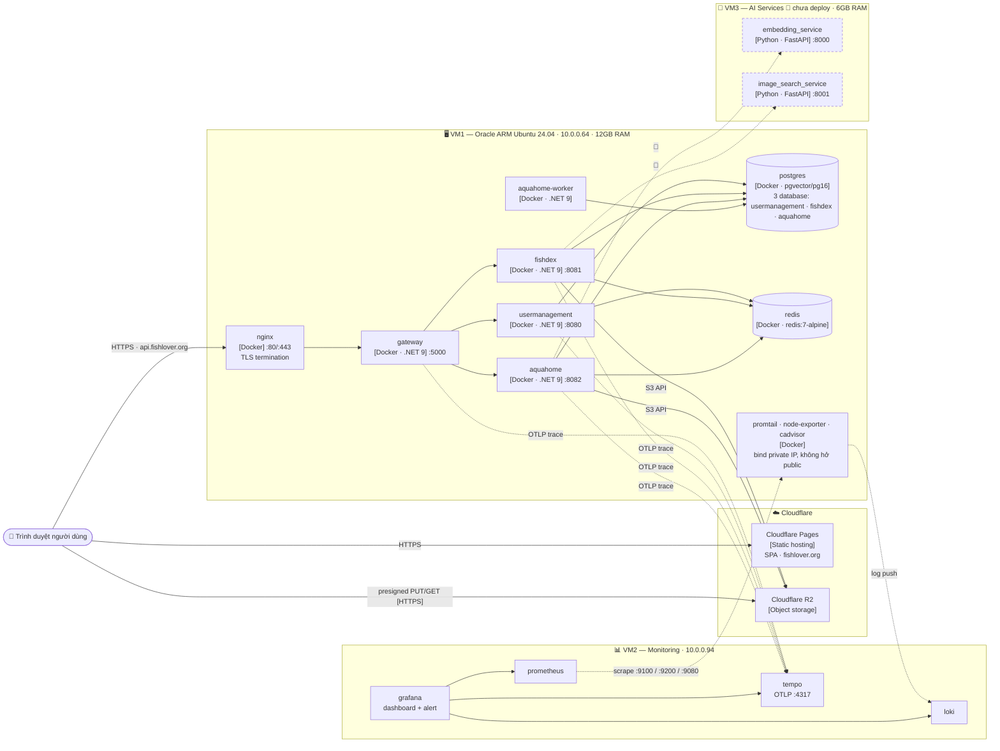

[← Về danh sách (00)](./00-overview.html)

# FishLover — Deployment Diagram

> Cập nhật: 2026-10-01 · Các container ở [Level 2](./02-container.md) thực sự chạy ở đâu.
>
> **Deployment nằm trong C4, nhưng không phải một "level".** C4 có 4 level cốt lõi (Context → Container → Component → Code) cộng với các **diagram bổ sung**: System Landscape, Dynamic và Deployment. Vì vậy file này cố ý **không đánh số** — dãy `01/02/03/04` chỉ dành cho 4 level. Level 3 (Component) là bóc tách bên trong *một* container, hiện chưa cần.

## Diagram

## Node

| Node | Chạy gì | Ghi chú |
|---|---|---|
| **VM1** — Oracle ARM, 10.0.0.64 | nginx, gateway, usermanagement, fishdex, aquahome, aquahome-worker, postgres, redis, promtail, node-exporter, cadvisor | Tất cả trên Docker network `fishlover_prod`. Chịu toàn bộ traffic người dùng |
| **VM2** — 10.0.0.94 | prometheus, loki, tempo, grafana | Chỉ nhận telemetry từ VM1 qua subnet private, không phục vụ người dùng |
| **VM3** 🚧 | embedding_service, image_search_service | Mới có scaffold thư mục, chưa có `main.py`/Dockerfile |
| **Cloudflare Pages** | SPA tĩnh đã build | Deploy tự động khi push, không qua Azure DevOps |
| **Cloudflare R2** | Ảnh loài, ảnh hồ, snapshot, video dự thi | Trình duyệt đọc/ghi trực tiếp bằng presigned URL |

## Điểm khác biệt quan trọng so với Level 2

Level 2 vẽ **ba database tách rời** theo service. Thực tế triển khai hiện nay chỉ có **một container `postgres`** chứa ba database, và **một container `redis`** dùng chung. Chúng tách được bất cứ lúc nào mà không phải đổi code, nhưng ở thời điểm này nếu đếm container đang chạy thì là **một**, không phải ba.

## Ghi chú phạm vi — không vẽ ở đây

- Quy trình CI/CD (Azure DevOps pipeline cho 4 service, Cloudflare Pages tự build từ Git).
- Backup database, gia hạn chứng chỉ TLS, quản lý secret (`.env` trên VM + Azure DevOps Library).
- Tiến độ sprint/epic — thuộc Notion, không thuộc tài liệu kiến trúc.
