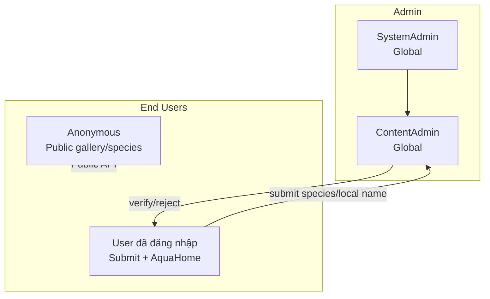
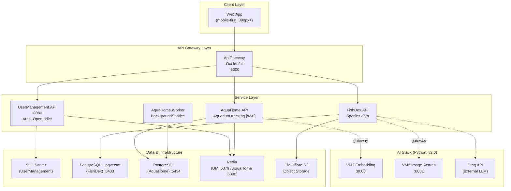
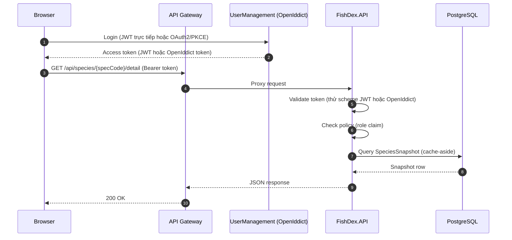
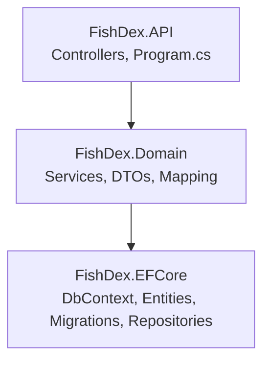

# FishDex — Hướng dẫn Onboarding cho BE Developer

## Mục lục

- [1. Tổng quan The FishLover (Business Domain Overview)](#1-tổng-quan-the-fishlover-business-domain-overview)
  - [1.1 Giới thiệu sản phẩm](#11-giới-thiệu-sản-phẩm)
  - [1.2 Business modules](#12-business-modules)
  - [1.3 Actors & roles](#13-actors--roles)
  - [1.4 Architecture overview](#14-architecture-overview)
- [2. System Architecture](#2-system-architecture)
  - [2.1 Kiến trúc tổng thể](#21-kiến-trúc-tổng-thể)
  - [2.2 API Gateway](#22-api-gateway)
  - [2.3 Service Catalog](#23-service-catalog)
  - [2.4 Authentication & Authorization](#24-authentication--authorization)
  - [2.5 Inter-service Communication](#25-inter-service-communication)
  - [2.6 AI Stack (v2.0)](#26-ai-stack-v20)
- [3. Backend Architecture Patterns](#3-backend-architecture-patterns)
  - [3.1 Kiến trúc 3 lớp (FishDex)](#31-kiến-trúc-3-lớp-fishdex)
  - [3.2 Dependency Injection](#32-dependency-injection)
  - [3.3 Repository Pattern (không CQRS/MediatR)](#33-repository-pattern-không-cqrsmediatr)
  - [3.4 Domain Model chi tiết](#34-domain-model-chi-tiết)
  - [3.5 Community Contribution Pattern](#35-community-contribution-pattern)
  - [3.6 Caching Strategy](#36-caching-strategy)
  - [3.7 Object Storage (Cloudflare R2)](#37-object-storage-cloudflare-r2)
- [4. Data Layer & Infrastructure](#4-data-layer--infrastructure)
  - [4.1 Database Landscape](#41-database-landscape)
  - [4.2 ETL từ FishBase](#42-etl-từ-fishbase)
  - [4.3 Observability](#43-observability)
  - [4.4 Deployment](#44-deployment)
- [5. Development Guide](#5-development-guide)
  - [5.1 Environment Setup Checklist](#51-environment-setup-checklist)
  - [5.2 Repository Layout](#52-repository-layout)
  - [5.3 Chạy Local](#53-chạy-local)
  - [5.4 Common Development Tasks](#54-common-development-tasks)
  - [5.5 Testing (gap hiện tại)](#55-testing-gap-hiện-tại)
  - [5.6 Workflow & Production Checklist](#56-workflow--production-checklist)

---

# 1. Tổng quan The FishLover (Business Domain Overview)

## 1.1 Giới thiệu sản phẩm

**The FishLover** là nền tảng dành cho người nuôi cá cảnh (aquarium hobbyist), gồm hai mảng chính:

- **Tra cứu loài cá** (species lookup) — dữ liệu khoa học lấy từ **FishBase** (cơ sở dữ liệu cá toàn cầu), được ETL và lọc lại chỉ giữ các loài cá nước ngọt phù hợp nuôi cảnh (~2.000–3.500 loài trên tổng ~35.000 loài của FishBase).
- **Quản lý hồ cá cá nhân** (aquarium tracking) — theo dõi hồ, nhắc lịch chăm sóc, contest/gallery công khai cho cộng đồng chia sẻ hồ cá.

> **Lưu ý về tên gọi:** "FishDex" **không phải** tên của toàn bộ platform — đó là tên của **microservice dữ liệu loài cá**. Platform/brand đầy đủ tên là **"The FishLover"**. Tài liệu này tập trung vào FishDex service, nhưng đặt trong bối cảnh toàn hệ thống ở Section 1–2.

Hệ thống đang trong roadmap 3 phase:
- **v1.0** — Foundation (species lookup + user management cơ bản)
- **v1.1** — Polish, không có AI (community contribution, aquarium tracking, contest)
- **v2.0** — AI stack (Groq LLM, semantic search bằng pgvector, image search bằng CLIP) — phase này đã dời từ kế hoạch ban đầu sang khoảng 06/2026.

## 1.2 Business modules

Hệ thống gồm các domain module chính, mỗi module tương ứng (gần như) 1:1 với một microservice:

1. **User Management** — Đăng ký/đăng nhập, invitation-based registration, xác thực email và reset password (qua Resend), phát hành token OAuth2/PKCE qua OpenIddict song song với JWT trực tiếp.

2. **FishDex (Species Data)** — Tra cứu loài cá theo family/genus/species, tìm kiếm, chi tiết loài (ecology, morphology, occurrence, stock, common names, hình ảnh). Đây cũng là nơi chứa tính năng **community contribution**: người dùng submit loài lai (hybrid) chưa có trong FishBase, hoặc submit tên gọi địa phương (local name) cho loài đã có — cả hai đều cần admin duyệt trước khi public.

3. **AquaHome (Aquarium Tracking)** — Theo dõi hồ cá cá nhân, snapshot công khai (public gallery), contest, nhắc lịch chăm sóc (reminder qua BackgroundService), đồng bộ YouTube. Đang trong quá trình xây dựng (`[in progress]`), gọi ngược vào FishDex qua `PublicSpeciesController` để lấy dữ liệu loài + resign presigned URL ảnh cho người xem không đăng nhập.

4. **Platform / Cross-cutting** — Rate limiting (`FishLoverRateLimiter`), quota engine (`RoleQuota`/`QuotaUsage`), observability (OpenTelemetry + Prometheus + Tempo), object storage (Cloudflare R2), tất cả được chia sẻ qua thư viện `FishLover.Shared`.

## 1.3 Actors & roles

| Actor | Scope | Responsibilities |
|-------|-------|------------------|
| SystemAdmin | Global | Toàn quyền hệ thống, duyệt nội dung, quản lý user |
| ContentAdmin | Global | Duyệt community species (hybrid) và local name contributions |
| User (đã đăng nhập) | Cá nhân | Tra cứu loài, submit community species/local name, quản lý hồ cá, tham gia contest |
| Anonymous (chưa đăng nhập) | Public | Xem gallery công khai, xem loài qua Public API (không cần login) |



## 1.4 Architecture overview

The FishLover áp dụng kiến trúc **microservices phía sau một API Gateway (Ocelot)**. Client (web/mobile) gọi vào Gateway, Gateway route request đến 1 trong 3 backend service (**UserManagement**, **FishDex**, **AquaHome**), mỗi service sở hữu database riêng (database-per-service). Các service dùng chung một thư viện `FishLover.Shared` cho JWT, tracing, và các model dùng chung (`PagedResult<T>`).

Không giống nhiều hệ thống enterprise lớn, FishLover **không dùng CQRS/MediatR** và **không dùng Autofac cho mọi service** — đây là một hệ thống pragmatic, được xây dựng nhanh với 3 lớp đơn giản (API / Domain / EFCore) thay vì Clean Architecture đầy đủ. Xem chi tiết ở [Section 3](#3-backend-architecture-patterns).

Xem chi tiết kiến trúc tại [Section 2: System Architecture](#2-system-architecture).

---

# 2. System Architecture

Phần này mô tả kiến trúc kỹ thuật tổng thể của The FishLover — tầng gateway, danh sách service, cơ chế xác thực, giao tiếp giữa các service, và AI stack (v2.0).

## 2.1 Kiến trúc tổng thể

The FishLover gồm 3 tầng chính:

1. **Client Layer** — Web app (FrontEnd/), truy cập chủ yếu qua mobile browser (iPhone 12+, 390px width là baseline thiết kế — đây là quy tắc bắt buộc khi thiết kế API response và UI).

2. **API Gateway Layer** — Ocelot 24 (`ApiGateway/`), single entry point. Hiện tại route `/api/**` → UserManagement (`user-management:8080`) và `/storage/**` → object storage (MinIO local / Cloudflare R2 prod).

3. **Service Layer** — 3 microservice .NET 9: **UserManagement**, **FishDex**, **AquaHome**, cộng thêm các Python microservice bên ngoài solution .NET cho AI (VM3 embedding service, image search service).

4. **Data & Infrastructure Layer** — Mỗi service một database riêng: SQL Server (UserManagement), PostgreSQL + pgvector (FishDex), PostgreSQL (AquaHome). Redis cho UserManagement và AquaHome. Cloudflare R2 (S3-compatible) cho object storage.



## 2.2 API Gateway

Cấu hình route trong `ApiGateway/ocelot.json`:

- `/api/{everything}` → `user-management:8080`
- `/storage/{everything}` → `storage:9000` (MinIO local, R2 prod)

Gateway hiện tại đóng vai trò routing/reverse-proxy đơn giản qua Ocelot — chưa thấy pattern rate limiting hay API key validation tập trung ở tầng gateway (rate limiting hiện làm ở tầng service qua `FishLoverRateLimiter` trong `FishLover.Shared`).

**Lưu ý khi phát triển:** FishDex có route riêng cho `PublicSpeciesController` (`[AllowAnonymous]`) để AquaHome và các client không đăng nhập có thể lấy dữ liệu loài + resign presigned URL ảnh — pattern này tồn tại chính vì Gateway không tự xử lý việc "một phần API public, một phần cần login" trên cùng một route.

## 2.3 Service Catalog

| Service | Path | Framework | DB | Auth | Cache | Chức năng |
|---|---|---|---|---|---|---|
| ApiGateway | `BackEndProject/ApiGateway/` | .NET 9 + Ocelot 24 | — | — | — | Reverse proxy, single entry point |
| UserManagement | `BackEndProject/UserManagement/` | .NET 9 | SQL Server | OpenIddict + JWT | Redis :6379 | Auth, user profile, invitation |
| FishDex | `BackEndProject/FishDex/` | .NET 9 | PostgreSQL + pgvector :5433 | JWT Bearer + OpenIddict (dual scheme) | `IMemoryCache` + `SpeciesSnapshot` (DB cache-aside) | Species data, community contribution |
| AquaHome | `BackEndProject/AquaHome/` | .NET 9 | PostgreSQL :5434 | JWT Bearer | Redis :6380 | Aquarium tracking, contest, gallery *(WIP)* |
| AquaHome.Worker | `BackEndProject/AquaHome/AquaHome.Worker/` | .NET 9 BackgroundService | — | — | — | Task reminder scheduler |

Mỗi service (trừ ApiGateway và Worker) theo cấu trúc 3-project riêng: `{Service}.API`, `{Service}.Domain`, `{Service}.EFCore`. Đây **không phải Clean Architecture 5 lớp** như một số hệ thống khác — không có lớp "Core" tách biệt domain entity khỏi mọi framework dependency; entity EF Core nằm trực tiếp trong `{Service}.EFCore`.

## 2.4 Authentication & Authorization

**UserManagement** là identity provider trung tâm, phát hành 2 loại token song song:

1. **JWT trực tiếp (symmetric key)** — login truyền thống, cấu hình qua `JwtSettings` (SecretKey/Issuer/Audience/ExpiryMinutes).
2. **OpenIddict OAuth2/PKCE** — dùng cho các luồng OAuth chuẩn, JWKS discovery qua `{AuthServer:Authority}/.well-known/openid-configuration`.

**FishDex chấp nhận cả hai scheme cùng lúc** (`Program.cs`):

```csharp
options.AddAuthentication()
    // scheme mặc định — JWT Bearer symmetric key
    // scheme "OpenIddict" — validate qua JWKS, MapInboundClaims = false, RoleClaimType = "role"
```

`MapInboundClaims = false` là một fix quan trọng cần nhớ: mặc định .NET sẽ rename claim `role` thành một URI dài (`http://schemas.xmlsoap.org/...`), làm `RequireRole`/`[Authorize(Roles=...)]` không hoạt động đúng nếu không tắt tính năng này.

Authorization policy được định nghĩa thủ công để áp dụng cho **cả hai scheme cùng lúc**:

```csharp
options.AddPolicy("RequireSystemAdmin", p => p.AddAuthenticationSchemes(bothSchemes).RequireRole("SystemAdmin"));
options.AddPolicy("RequireContentAdmin", p => p.AddAuthenticationSchemes(bothSchemes).RequireRole("SystemAdmin", "ContentAdmin"));
```

Controllers dùng `[Authorize(Policy = "RequireContentAdmin")]` (thấy ở toàn bộ endpoint moderation của community species/local name).

`ICurrentUserSession` (`FishLover.Shared`) là scoped service parse `UserId`/`Roles` từ `HttpContext.User` claims — inject vào domain service thay vì service tự đọc `HttpContext` trực tiếp.

> **Cảnh báo dev-only shortcut:** FishDex hiện set `ValidateAudience = false` cho scheme `"OpenIddict"` — đây là shortcut cho local dev, **phải sửa trước khi lên production** (xem [5.6](#56-workflow--production-checklist)).



## 2.5 Inter-service Communication

**Không dùng message queue** (không RabbitMQ/Kafka/Azure Service Bus) trong toàn bộ solution hiện tại.

**Synchronous — HTTP trực tiếp/qua gateway:** AquaHome gọi vào FishDex's `PublicSpeciesController` để lấy species summary/distribution và resign presigned URL ảnh cho các trang public (gallery, contest) — không cần client tự authenticate với FishDex.

**Không có shared database access** — mỗi service chỉ đọc/ghi database của chính mình; giao tiếp cross-service qua HTTP API.

## 2.6 AI Stack (v2.0)

Phase AI (dự kiến 06/2026) không nằm trong solution .NET — là các Python microservice riêng, nằm ở `Pipeline/OracleVM/VM3/`, gọi qua Gateway:

| Thành phần | Path | Port | Vai trò |
|---|---|---|---|
| Embedding service | `Pipeline/OracleVM/VM3/embedding_service` | `:8000` | Tính embedding text 384-d cho RAG |
| Image search service | `Pipeline/OracleVM/VM3/image_search_service` | `:8001` | Tính CLIP embedding 512-d cho tìm ảnh |
| Groq API | External | — | LLM cho RAG/chatbot |

**pgvector trong FishDex:**
- `SpeciesChunk.Embedding` — 384-d, HNSW index, dùng cho RAG (semantic search trên nội dung loài).
- `SpeciesMedia.ClipEmbedding` — 512-d, HNSW index, dùng cho image search.
- **Không mix hai loại embedding trong cùng một query** — hai code path tách biệt.

**Fallback rules (đã quyết định, chưa implement hết):**
- Groq trả 429 (rate limit) → FishDex trả 503 cho FE, **không tự động retry**.
- VM3 service down → trả 503, **không fallback về local embedding**.
- Groq API down liên tục >5 phút → alert + có sẵn fallback command chuyển sang Ollama Gemma 2B (nhánh fallback của Story 2.3, giữ sẵn sàng nhưng chưa kích hoạt mặc định).

**Latency budget:**
- RAG (Groq): < 1.5s p95 (embedding 50ms + pgvector 100ms + Groq 1000ms + network 200ms)
- Image search: < 700ms p95 (CLIP 200ms + pgvector 100ms + presigned URL 300ms + network 100ms)

---

# 3. Backend Architecture Patterns

Phần này tập trung vào **FishDex service** — pattern bạn sẽ làm việc hàng ngày với tư cách BE developer.

## 3.1 Kiến trúc 3 lớp (FishDex)

```
FishDex.API → FishDex.Domain → FishDex.EFCore
```

| Project | Vai trò |
|---|---|
| `FishDex.API` | Controllers, `Program.cs` (top-level statements, không có `Startup.cs` riêng), Swagger (2 security definition: Bearer + OAuth2/PKCE), CORS, health checks |
| `FishDex.Domain` | Business logic services, DTOs, mapping extensions (`ToDto()` — **không dùng AutoMapper**), settings-binding classes, helper |
| `FishDex.EFCore` | `FishDexDbContext`, entity, migrations, repository (generic + per-entity), `SpeciesSnapshot` cache-aside |

**Khác biệt quan trọng so với Clean Architecture:** không có layer "Core" thuần domain tách biệt khỏi EF Core — entity EF Core nằm trực tiếp trong `FishDex.EFCore` và có thể chứa navigation property, data annotation. Business logic không đi qua Command/Query/Handler (không MediatR) — controller gọi thẳng domain service, domain service gọi repository.



Entity trong `FishDex.EFCore/Entity/` được tổ chức **theo subdomain**, mô phỏng data model của FishBase, không theo layer kiến trúc: `Species/`, `Ecologies/`, `Ecosystem/`, `MorphData/`, `Occurrence/`, `Stocks/`, `Media/`, `Cache/`.

## 3.2 Dependency Injection

FishDex và AquaHome dùng **plain Microsoft.Extensions.DependencyInjection** — không Autofac, không auto-discovery/reflection scanning. Đăng ký thủ công qua extension method:

```csharp
// FishDex.EFCore/Extensions/ServiceCollectionExtensions.cs
services.AddFishDexDatabase(config);   // FishDexDbContext + Npgsql + retry-on-failure
services.AddFishDexRepositories();     // ~27 dòng AddScoped<IX, X>() — 1 dòng / repository

// FishDex.Domain/Extensions/ServiceCollectionExtensions.cs
services.AddFishDexServices();         // ~9 domain service, Scoped; IStorageService là Singleton
```

Gọi từ `FishDex.API/Program.cs`:
```csharp
builder.Services
    .AddFishDexDatabase(config)
    .AddFishDexRepositories()
    .AddFishDexServices();
```

> **Lưu ý:** UserManagement dùng **Autofac modules** (`UserManagementModule`) thay vì Microsoft DI — nếu bạn quen với UserManagement, đừng mang tư duy "auto-register qua module scan" sang FishDex. FishDex yêu cầu thêm dòng đăng ký thủ công mỗi khi tạo service/repository mới.

## 3.3 Repository Pattern (không CQRS/MediatR)

Không có MediatR trong toàn solution. Business logic nằm trực tiếp trong **domain service**, gọi qua **generic repository pattern**:

```csharp
// FishDex.EFCore/Repository/BaseGeneric/
public interface IGenericRepository<T> { /* CRUD cơ bản */ }
public class GenericRepository<T> : IGenericRepository<T> { /* ... */ }
```

Mỗi entity có interface + implementation riêng kế thừa/mở rộng generic repository (ví dụ `ISpeciesRepository`/`SpeciesRepository`) — hiện có khoảng 25 repository.

**Luồng xử lý một request điển hình:**

```
Controller → IXxxService (Domain) → IXxxRepository (EFCore) → DbContext → PostgreSQL
```

Ví dụ: `SpeciesController` → `ISpeciesService` → `ISpeciesRepository` → `FishDexDbContext`.

Khi thêm feature mới, **không tạo Command/Query/Handler** — tạo method mới trên service interface + implementation, gọi repository tương ứng.

## 3.4 Domain Model chi tiết

**`Species`** (`Species/Species.cs`) — entity trung tâm:

```csharp
public class Species
{
    public Guid Id { get; set; }
    public int SpecCode { get; set; }       // ID số của FishBase — dùng làm join key ở MỌI nơi
    public int? GenusCode { get; set; }
    public int FamCode { get; set; }
    public Guid FamId { get; set; }
    public WaterType WaterType { get; set; }
    public string SpeciesName { get; set; } = string.Empty;
    // Author, Length, Weight, Vulnerability, LifeCycle, DemersPelag, ...
    public virtual Genus? Genus { get; set; }
    public virtual Family Family { get; set; }
    public ICollection<CommonName> CommonNames { get; set; } = [];
    public ICollection<Stock> Stocks { get; set; } = [];
    public ICollection<SystemImage> Pictures { get; set; }
}
```

**Quan trọng:** các quan hệ 1-N (`Stocks`, `Pictures`, `CommonNames`) dùng **`SpecCode` làm khóa ngoại**, không phải `Id` (Guid). `Genus` liên kết `Species` qua `GenusCode` (int). Đây là điểm khác biệt cần nhớ khi viết query mới — luôn nghĩ theo `SpecCode`, không phải `Id`.

**Các subdomain khác** (mỗi cái có entity + repository riêng):
- `Ecologies/` — Ecology + 6 bảng con 1:1 qua `EcologyId` (HabitatZone, FeedingAndDiet, Associations, Substrate, SpecialHabitat, CircadianBehavior)
- `MorphData/` — MorphData + 5 bảng con 1:1 qua `StockCode` (Teeth, Pigmentation, Fins, Meristics, Metrics)
- `Stocks/` — Stock + 5 bảng con 1:1 qua `StockCode` (Conservation, Environment, ExternalRef, DataAvailability, Metadata)
- `Occurrence/` — điểm ghi nhận địa lý
- `Ecosystem/` — EcosystemRef + bảng junction
- `Media/SystemImage.cs` — ảnh loài. **Quy tắc bắt buộc:** luôn dùng computed property `pic.ObjectKey` (= `{SpecCode}/{Id}{ext}`) khi gọi `IStorageService.GetPresignedUrlAsync` — không tự ghép path thủ công, không dùng `pic.Name` trực tiếp.

`Family` có PK `Guid Id` (dùng để obfuscate path trên R2) + unique index trên `FamCode`. `Genus` có PK `int GenusCode`.

## 3.5 Community Contribution Pattern

Đây là mảng tính năng mới nhất và đang phát triển tích cực (xem git log gần đây) — có 2 luồng community contribution độc lập, **không dùng entity riêng cho "community", mà tái sử dụng entity có sẵn với các field trạng thái**:

**A. Community Species (loài lai/hybrid không có trong FishBase)**

Lưu trực tiếp vào bảng `SpeciesSnapshot` (vốn là cache-aside, xem 3.6) với:
- `DataSource = Community`
- `SpecCode >= 500_000` (hằng số `CommunityMinSpecCode` trong `SpeciesService` — dùng để phân biệt species thật của FishBase với species do cộng đồng submit)
- `IsVerified = false` cho tới khi admin duyệt

Endpoint (`CommunitySpeciesController`, `/api/species/community`, `[Authorize]`):

| Method | Route | Policy | Mô tả |
|---|---|---|---|
| POST | `/` | User | Submit species mới (tạo `SpeciesSnapshot` `IsVerified=false`) |
| GET | `/mine` | User | Danh sách submission của user hiện tại |
| GET | `/pending` | `RequireContentAdmin` | Hàng đợi chờ duyệt |
| PATCH | `/{specCode}/verify` | `RequireContentAdmin` | Duyệt |
| PATCH | `/{specCode}/reject` | `RequireContentAdmin` | Từ chối (kèm reason) |

**B. Community Local Name (tên gọi địa phương cho loài đã có sẵn)**

Tái sử dụng entity `CommonName` (`Species/CommonName.cs`) — **không có entity "CommunityCommonName" riêng**:

```csharp
public class CommonName
{
    [Key] public int AutoCtr { get; set; }
    public int SpecCode { get; set; }
    public string ComName { get; set; } = string.Empty;
    public string? CountryCode { get; set; }
    public string? Language { get; set; }
    public bool IsPreferred { get; set; }
    public int Rank { get; set; }
    // Community + moderation
    public Guid? ContributedBy { get; set; }     // null = dòng gốc từ FishBase
    public bool IsVerified { get; set; } = true; // true mặc định cho dòng FishBase; false cho tới khi admin duyệt user submit
    public Guid? ReviewedBy { get; set; }
    public string? RejectionReason { get; set; }
    public virtual Species Species { get; set; } = null!;
}
```

Endpoint (`CommunityCommonNamesController`, `/api/species`, `[Authorize]`):

| Method | Route | Policy | Mô tả |
|---|---|---|---|
| POST | `/{specCode}/common-names` | User | Submit tên gọi mới. **Từ chối nếu `specCode >= 500000`** — không thể thêm local name cho species dạng community/hybrid |
| GET | `/common-names/mine` | User | Danh sách submission của user |
| GET | `/common-names/pending` | `RequireContentAdmin` | Hàng đợi chờ duyệt |
| PATCH | `/common-names/{autoCtr}/verify` | `RequireContentAdmin` | Duyệt 1 dòng |
| PATCH | `/common-names/verify-batch` | `RequireContentAdmin` | Duyệt hàng loạt (body `AutoCtrs: int[]`) |
| PATCH | `/common-names/{autoCtr}/reject` | `RequireContentAdmin` | Từ chối |

**Nguyên tắc chung cần nhớ khi mở rộng 2 luồng này:** phân biệt "dữ liệu FishBase gốc" và "dữ liệu do cộng đồng đóng góp" luôn dựa trên field trạng thái (`ContributedBy`, `IsVerified`, ngưỡng `SpecCode`) trên entity đã có sẵn — không tạo bảng/entity song song mới trừ khi model thực sự khác biệt về cấu trúc.

## 3.6 Caching Strategy

FishDex **không dùng Redis** (khác với UserManagement và AquaHome) — dùng 2 cơ chế:

**1. `IMemoryCache` (in-process):**

```csharp
// Program.cs
builder.Services.AddMemoryCache(opts => opts.SizeLimit = 3_000);
```

Dùng cho lookup nhẹ, ngắn hạn — ví dụ mapping ecology/habitat trong `EcologyService`.

**2. Cache-aside qua bảng `SpeciesSnapshot` (`ISpeciesCache`/`DbSpeciesCache`, `FishDex.EFCore/Cache/`):**

```csharp
Task<SpeciesSnapshot?> GetOrPopulateAsync(int specCode);
Task<IReadOnlyList<SpeciesSnapshot>> GetOrPopulateManyAsync(IEnumerable<int> specCodes); // batch
Task RefreshAsync(int specCode);   // force re-flatten
Task InvalidateAsync(int specCode); // evict
```

`GetOrPopulateAsync` kiểm tra bảng `SpeciesSnapshots` trước; nếu miss, gọi `FishBaseFlattener.FlattenAsync(specCode)` để join/flatten các bảng chuẩn hóa (Species, Family, Genus, Ecology, Stock, ...) thành 1 dòng, lưu lại, rồi trả về. Đây chính là read-model mà API thực sự truy vấn cho species detail/summary — **không join trực tiếp các bảng chuẩn hóa mỗi lần đọc**. Xử lý race condition khi nhiều request cùng populate một `specCode` bằng cách catch `DbUpdateException` và refetch.

`SpeciesSnapshot` đóng vai trò kép — vừa là cache-aside read model, vừa là bảng lưu trữ chính cho community species (3.5A). Khi sửa schema bảng này, cần cân nhắc cả hai use case.

## 3.7 Object Storage (Cloudflare R2)

`IStorageService`/`S3StorageService` (`FishDex.Domain/Services/S3StorageService.cs`) — dùng S3-compatible API để gọi Cloudflare R2 (không phải AWS S3, không phải Azure Blob). Local dev dùng MinIO (S3-compatible) qua Docker Compose để giả lập R2.

Cấu hình (`Storage:` trong appsettings): `Provider=r2`, `ServiceUrl`, `AccessKey`/`SecretKey`, `BucketName` (`system-image`), `PresignedUrlExpiryMinutes`, `ForcePathStyle`.

Nhắc lại quy tắc bắt buộc: object key luôn lấy từ `pic.ObjectKey` (computed property, format `{SpecCode}/{Id}{ext}`) — đây là nguồn sự thật duy nhất, không tự ghép chuỗi path.

---

# 4. Data Layer & Infrastructure

## 4.1 Database Landscape

**Database-per-service**: mỗi service sở hữu database riêng, không service nào truy cập trực tiếp DB của service khác.

| Service | Engine | Port (local) | Provider |
|---|---|---|---|
| UserManagement | SQL Server | — | EF Core SqlServer |
| FishDex | PostgreSQL 16 + pgvector | 5433 | Npgsql |
| AquaHome | PostgreSQL 16 | 5434 | Npgsql |

**FishDex — `FishDexDbContext`** (`FishDex.EFCore/DbContexts/FishDexDbContext.cs`), migrations assembly `"FishDex.EFCore"`. Migrations hiện có (thứ tự thời gian):

1. `InitialCreate`
2. `AddCommonName`
3. `MakeOptionalColumnsNullable`
4. `Story1_9_DetailEnrichment` *(quy ước: migration liên quan đến feature theo story được đặt tên kèm mã story)*
5. `AddSpeciesSnapshot`
6. `AddAssociationsBehavior`

Lệnh migration cho FishDex (chạy từ `BackEndProject/`, **không cần** `--startup-project` như UserManagement/AquaHome):

```bash
dotnet ef migrations add <MigrationName> --project FishDex/FishDex.EFCore
dotnet ef database update --project FishDex/FishDex.EFCore
```

> **Cảnh báo:** `Program.cs` chạy `db.Database.MigrateAsync()` tự động khi startup nếu `AutoMigrate:OnStartup = true` trong config. Đây là shortcut cho local dev — **race condition nếu chạy nhiều instance ở production**. Xem checklist ở [5.6](#56-workflow--production-checklist).

## 4.2 ETL từ FishBase

ETL nằm **ngoài solution .NET**, viết bằng Python (polars + psycopg2), tại `Pipeline/local/FishDex/`:

```
Pipeline/local/FishDex/
├── parquetData/         ← đặt file .parquet export từ FishBase vào đây (gitignored)
├── etl/
│   ├── config.py        ← DB_URL, ngưỡng lọc (AQUARIUM_VALUES, INCLUDE_BRACKISH)
│   ├── db.py            ← connection + upsert helper + type coercion
│   ├── filter.py        ← compute_spec_codes() — filter loài nước ngọt phù hợp nuôi cảnh
│   ├── loaders/          ← families.py, genera.py, species.py, stocks.py, ecology.py, morph.py, ecosystem.py, occurrence.py, common_names.py, images.py
│   └── run.py            ← entry point, load theo thứ tự FK
├── inspect.py            ← bước 0: xem phân bố giá trị `Aquarium`/`AquariumFishII` trước khi filter
├── post_etl.sql          ← reset sequence Postgres sau khi insert PK tường minh
└── docker-compose.yml    ← PostgreSQL 16 + pgvector local
```

**Quy tắc bắt buộc:** luôn đọc dữ liệu FishBase từ file `.parquet`, không dùng `.csv`.

**Thứ tự load** (tôn trọng FK dependency): Families → Genuses → Species (filter áp dụng ở đây) → Stocks (+5 bảng con) → Ecology (+6 bảng con) → MorphData (+5 bảng con, optional) → EcosystemRefs → Ecosystem junction → Occurrence (optional, dữ liệu lớn) → CommonNames → SystemImages (optional).

Idempotent qua UPSERT (`ON CONFLICT DO UPDATE`) cho bảng có PK tự nhiên; bảng PK tự sinh (Occurrence, SystemImage) dùng delete-rồi-insert-lại. Batch 500 dòng/lần, transaction theo từng bảng, đọc cột kiểu defensive (`row.get()`, chấp nhận thiếu cột trong parquet). Có flag CLI `--dry-run` / `--only N` / `--steps N,M` / `--from N` để debug từng bước.

Vì insert PK tường minh, phải chạy `post_etl.sql` để reset sequence Postgres sau ETL. Đường đi khuyến nghị lên production: verify ở local trước, sau đó `pg_dump --data-only` rồi restore lên prod (sau khi prod đã chạy EF migration của chính nó) — hoặc trỏ thẳng `DB_URL` sang prod và chạy lại ETL.

Chi tiết đầy đủ đọc trực tiếp `Pipeline/local/FishDex/etl/ETL_STRATEGY.md`.

## 4.3 Observability

- **Tracing/Metrics:** OpenTelemetry 1.10 + Prometheus, wiring qua `FishLover.Shared/Extensions/OpenTelemetryExtensions.cs`, service name `"fishdex"`. Export endpoint cấu hình qua `OpenTelemetry:ExportEndpoint` trong appsettings.
- **Logging:** Serilog — console + rolling file `logs/fishdex-.log`.
- **Backend cho trace:** Tempo (theo commit gần đây "harden exporter ports").
- **Health check:** `AddNpgSql()`, expose tại `/health`.
- **Groq rate limit monitoring:** log timestamp + token count mỗi LLM request tới Grafana, alert nếu >25 RPM (buffer dưới ngưỡng 30 RPM của Groq).

## 4.4 Deployment

- CI/CD templates (Azure DevOps + GitHub Actions) và Docker Compose stack nằm ở `Pipeline/` (repo root, ngang hàng `BackEndProject/`).
- Deploy target: Oracle VM (`Pipeline/OracleVM/`).
- `nuget.config` cấp project ép restore chỉ từ `nuget.org` — không dùng private feed trong repo này.

---

# 5. Development Guide

## 5.1 Environment Setup Checklist

- **.NET SDK 9.0.x** — kiểm tra `dotnet --version`. Tải từ [dotnet.microsoft.com](https://dotnet.microsoft.com/download/dotnet/9.0).
- **Docker Desktop** — bắt buộc để chạy PostgreSQL local cho FishDex/AquaHome và Redis cho UserManagement/AquaHome.
- **Python 3.x** (cho ETL) — chỉ cần nếu bạn làm việc với `Pipeline/local/FishDex/etl/`, không cần cho việc chạy service .NET.
- **Database:** PostgreSQL 16 + pgvector extension (FishDex) — chạy qua Docker Compose local, không cần cài thủ công.

> **Lưu ý máy hiện tại (ghi chú riêng, không phải yêu cầu chung):** một số máy dev không có sẵn `dotnet-ef`, `node`, `npx`, `python` trên PATH — nếu gặp trường hợp này, chỉ `dotnet build` chạy được trực tiếp; các lệnh khác (migration, ETL, FE) cần đưa cho người dùng tự chạy trong terminal riêng.

## 5.2 Repository Layout

```
D:\Workspace\Practice\FishDex\
├── BackEndProject\           # .NET solution root — FishDex.sln
│   ├── ApiGateway\           # Ocelot gateway
│   ├── UserManagement\       # UserManagement.API / .Domain / .EFCore
│   ├── FishDex\              # FishDex.API / .Domain / .EFCore  ← service chính của guide này
│   ├── AquaHome\             # AquaHome.API / .Common / .Domain / .EFCore / .Worker
│   ├── Share\FishLover.Shared\  # JWT, OpenTelemetry, CurrentUserSession, PagedResult
│   └── CLAUDE.md             # ghi chú kiến trúc + Production Deployment Checklist
├── FrontEnd\                 # Web app
├── Pipeline\                 # Docker Compose, ETL Python, CI/CD templates, Oracle VM deploy
│   ├── local\FishDex\        # ETL FishBase + docker-compose PostgreSQL
│   ├── local\UserManagement\
│   ├── local\AquaHome\
│   └── OracleVM\VM3\         # embedding_service, image_search_service (Python, v2.0 AI)
├── R&D\                      # Nghiên cứu/thử nghiệm
└── WikiPage\                 # Static showcase site (Astro) — giới thiệu The FishLover là gì
```

**Lưu ý quan trọng:** Đây **là monorepo** (BE + FE + Pipeline + WikiPage cùng 1 repo) nhưng .NET solution chỉ nằm trong `BackEndProject/` — build/run luôn thực hiện từ thư mục này, còn lệnh Docker Compose chạy từ repo root vì `Pipeline/` nằm ngang hàng `BackEndProject/`.

**`WikiPage/` không phải tài liệu kỹ thuật** — đây là một dự án con riêng biệt: static showcase site (Astro + vanilla CSS, deploy Azure Static Web Apps) giới thiệu **The FishLover là gì** cho 2 nhóm đối tượng: (1) aquarist muốn tìm hiểu sản phẩm, (2) developer muốn *đóng góp* cho dự án (không phải người tiêu thụ API thương mại — API doc thật nằm ở Swagger, WikiPage không liệt kê endpoint). Hoàn toàn độc lập, không import từ `FrontEnd/` hay `BackEndProject/`, chỉ nên commit riêng trong `WikiPage/`. Đọc `WikiPage/CLAUDE.md` nếu cần chỉnh sửa nội dung site này — có quy tắc rõ về tone/voice (mộc mạc, không buzzword) vì đây là personal project của owner, không phải startup.

## 5.3 Chạy Local

Cách chuẩn để chạy local là **Docker Compose full-stack** (`Pipeline/local/docker-compose.local.yml`) — compose này build image trực tiếp từ code trong `BackEndProject/` (qua `Dockerfile.api` của từng service), chạy toàn bộ 4 API + DB + Redis cùng lúc, không cần cài `dotnet` SDK trên máy.

**Setup lần đầu:**

```bash
cd Pipeline/local
cp .env.example .env   # điền JWT_SECRET_KEY, DB password, R2 key... (xem chú thích trong file)
```

**Chạy toàn bộ stack:**

```bash
docker compose -f docker-compose.local.yml up -d
```

**Rebuild sau khi sửa code** (bắt buộc — compose build image từ source, sửa code C# không tự động apply như `dotnet watch`):

```bash
# Rebuild + restart 1 service cụ thể (nhanh hơn rebuild toàn bộ)
docker compose -f docker-compose.local.yml up -d --build fishdex-api

# Rebuild toàn bộ stack
docker compose -f docker-compose.local.yml up -d --build
```

**Xem log / restart / down:**

```bash
docker compose -f docker-compose.local.yml logs -f fishdex-api
docker compose -f docker-compose.local.yml restart fishdex-api
docker compose -f docker-compose.local.yml down          # giữ lại volume (data)
```

**Migration khi chạy Docker:** `AutoMigrate:OnStartup = true` trong `appsettings.Docker.json` của cả 3 service (FishDex/UserManagement/AquaHome) — container **tự chạy migration mỗi lần start**, không cần lệnh tay trong trường hợp thông thường. Chỉ cần nhớ 2 điều:

1. Sau khi thêm migration mới (`dotnet ef migrations add ...` — xem [4.1](#41-database-landscape)), **phải rebuild image** thì migration mới có trong container để auto-apply — `docker compose -f docker-compose.local.yml up -d --build fishdex-api`.
2. Nếu muốn tự chạy migration tay từ máy host (không qua container, ví dụ để debug) mà không cần dotnet SDK trong container: Postgres của FishDex đã map ra host port `5433`, nên `dotnet ef database update --project FishDex/FishDex.EFCore` từ `BackEndProject/` (máy có sẵn `dotnet-ef`) sẽ apply thẳng vào DB đang chạy trong Docker.

**Port mapping (full-stack compose):**

| Service | Port host |
|---|---|
| ApiGateway | `5000` |
| UserManagement API | `8080` |
| FishDex API | `8081` |
| AquaHome API | `8082` |
| FishDex PostgreSQL | `5433` |
| UserManagement PostgreSQL | `5435` |
| AquaHome PostgreSQL | `5434` |
| UserManagement Redis | `6379` |
| AquaHome Redis | `6380` |
| pgAdmin | `5050` |

**Chỉ cần hạ tầng (không build .NET app)** — nếu chỉ muốn chạy DB/Redis rồi tự `dotnet run`/`dotnet watch` từ IDE (hot reload nhanh hơn khi sửa code liên tục), dùng compose riêng từng service thay vì bản full-stack:

```bash
cd Pipeline/local/FishDex && docker compose up -d      # chỉ PostgreSQL 5433 + pgAdmin
# rồi, từ BackEndProject/:
dotnet run --project FishDex/FishDex.API/FishDex.API.csproj
```

Đây là lựa chọn phụ khi đang code và cần hot-reload nhanh — mặc định nên dùng full-stack Docker ở trên vì nó giả lập đúng môi trường Docker profile (network giữa các service qua tên container, không phải `localhost`).

Config local dev nằm trong `appsettings.Development.json` (bật test-data seeding + debug log) và `appsettings.Local.json` (gitignored, secret cá nhân như R2 credentials — được load thêm trong `Program.cs`). Không sửa `appsettings.json` cho mục đích local.

## 5.4 Common Development Tasks

**Thêm endpoint mới trong FishDex — quy trình (không CQRS):**

1. Thêm method vào interface service tương ứng trong `FishDex.Domain` (ví dụ `ISpeciesService`).
2. Implement method — gọi repository interface (`FishDex.EFCore`), không gọi `DbContext` trực tiếp từ Domain layer.
3. Nếu cần validate input, dùng FluentValidation (`AbstractValidator<T>`).
4. Thêm action method trong controller tương ứng (`FishDex.API/Controllers/`) — controller chỉ routing, không chứa business logic.
5. Nếu endpoint cần public/anonymous, cân nhắc thêm vào `PublicSpeciesController` thay vì đổi `[Authorize]` trên controller chính.

**Thêm EF Core migration cho FishDex:**

```bash
dotnet ef migrations add YourMigrationName --project FishDex/FishDex.EFCore
dotnet ef database update --project FishDex/FishDex.EFCore
```

Đặt tên migration mô tả rõ thay đổi; nếu migration gắn với 1 story cụ thể, có thể theo quy ước đã dùng (`Story1_9_DetailEnrichment`).

**Thêm repository mới:**

1. Tạo entity trong `FishDex.EFCore/Entity/{Subdomain}/`.
2. Tạo `IXxxRepository`/`XxxRepository` kế thừa `IGenericRepository<T>`/`GenericRepository<T>`.
3. Đăng ký thủ công trong `AddFishDexRepositories()` (`ServiceCollectionExtensions.cs`) — **không có auto-discovery**, quên bước này sẽ gây lỗi DI resolve ở runtime.

**Community contribution feature mới:** tham khảo pattern ở [3.5](#35-community-contribution-pattern) — ưu tiên thêm field trạng thái (`ContributedBy`, `IsVerified`, `ReviewedBy`, `RejectionReason`) vào entity đã có, thay vì tạo entity/bảng song song mới.

## 5.5 Testing (gap hiện tại)

**Hiện tại không có test project nào trong solution** — không xUnit/NUnit/MSTest package reference ở bất kỳ `.csproj` nào, không có folder `*Tests` cho FishDex/AquaHome/UserManagement. Một commit gần đây tên `BackgroundService + unit test` thực tế chỉ thêm `TaskReminderBackgroundService` (AquaHome) + tính năng web-push, không có test thật nào được thêm.

**Đây là gap cần lưu ý** khi lên kế hoạch: hiện chưa có safety net tự động cho regression — mọi thay đổi cần test thủ công qua Swagger/Postman trước khi merge, và nên cân nhắc thiết lập test project (xUnit) khi bắt đầu mở rộng logic phức tạp hơn (đặc biệt là community contribution moderation flow và AI stack sắp tới).

## 5.6 Workflow & Production Checklist

**Git convention (theo `docs:` commit gần nhất trong log):**
- **Tách commit BE/FE riêng** khi implement feature (`BackEndProject/`, `Pipeline/` vs `FrontEnd/`).
- **Ngoại lệ:** fix bug được phép gộp BE+FE trong 1 commit.

**Code review checklist gợi ý (dựa trên các quy tắc đã ghi nhận trong CLAUDE.md):**
- API response có tối ưu cho mobile không? (390px baseline, tránh payload thừa, pagination hợp lý)
- Object key ảnh có dùng `pic.ObjectKey` thay vì tự ghép path không?
- Repository/service mới đã đăng ký DI thủ công chưa? (không auto-discovery)
- Nếu động vào community contribution: field trạng thái (`IsVerified`, `ContributedBy`, ngưỡng `SpecCode`) có đúng logic không?
- Migration mới có ảnh hưởng đến `SpeciesSnapshot` (vừa là cache vừa là bảng lưu community species) không?

**Production Deployment Checklist** — các shortcut cố ý để local dev, **phải sửa trước khi lên PROD** (nguồn: `BackEndProject/CLAUDE.md`):

| # | File | Vấn đề | Fix |
|---|------|---------|-----|
| 1 | `UserManagement.API/Extensions/OpenIddictServerExtensions.cs` | `AddEphemeralEncryptionKey()` + `AddEphemeralSigningKey()` — key mất sau restart, lỗi khi multi-instance | Dùng X.509 cert từ Key Vault: `AddEncryptionCertificate()` + `AddSigningCertificate()` |
| 2 | Cùng file | `DisableTransportSecurityRequirement()` — cho phép HTTP | Xóa dòng này; PROD phải chạy HTTPS |
| 3 | `UserManagement.API/Program.cs` | `AutoMigrate:OnStartup` — race condition nếu multi-instance | Tắt flag, chạy `dotnet ef database update` như bước riêng trong CI/CD |
| 4 | `FishDex.API/Program.cs` | `ValidateAudience = false` trong scheme `"OpenIddict"` | Đăng ký FishDex như resource server trong OpenIddict, validate audience đúng |
| 5 | `UserManagement.API/appsettings.Docker.json` | `OpenIddict:Issuer = http://localhost:8080` | Đổi thành HTTPS domain thật của production |
| 6 | Docker Compose | DataProtection Keys không persist ngoài container | Mount volume hoặc dùng Azure Key Vault / AWS KMS |

Đây là checklist đã tồn tại sẵn trong `CLAUDE.md` — nhắc lại ở đây vì mọi BE dev mới cần biết các shortcut này **trước khi** vô tình deploy thẳng lên production.
