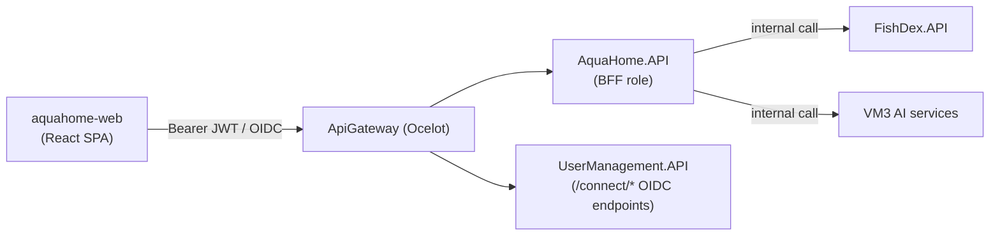
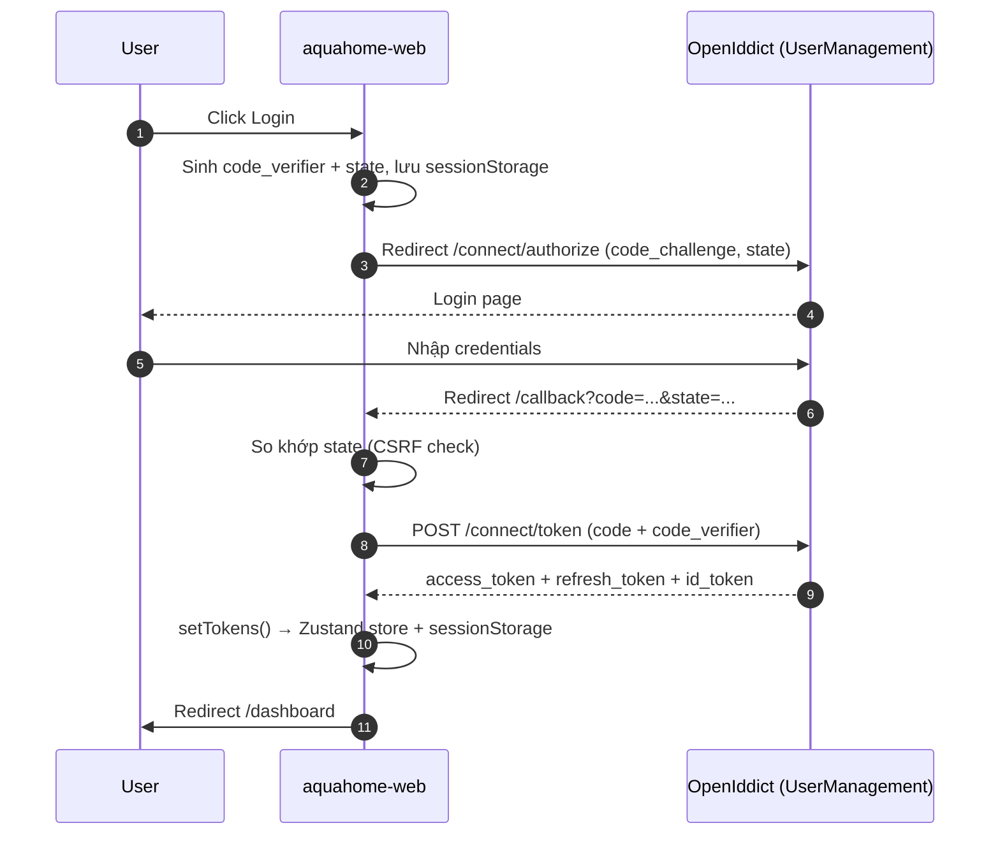

# The FishLover — Hướng dẫn Onboarding cho FE Developer

## Mục lục

- [1. Tổng quan (Business Context)](#1-tổng-quan-business-context)
  - [1.1 Sản phẩm & user chính](#11-sản-phẩm--user-chính)
  - [1.2 Vị trí FE trong toàn hệ thống](#12-vị-trí-fe-trong-toàn-hệ-thống)
  - [1.3 Roles & route access](#13-roles--route-access)
- [2. Tech Stack & Repository Layout](#2-tech-stack--repository-layout)
  - [2.1 Tech stack](#21-tech-stack)
  - [2.2 Monorepo layout (npm workspaces)](#22-monorepo-layout-npm-workspaces)
  - [2.3 Cấu trúc `apps/aquahome-web`](#23-cấu-trúc-appsaquahome-web)
- [3. Auth Flow (OAuth2/PKCE)](#3-auth-flow-oauth2pkce)
  - [3.1 Luồng login end-to-end](#31-luồng-login-end-to-end)
  - [3.2 Token storage & vì sao chọn vậy](#32-token-storage--vì-sao-chọn-vậy)
  - [3.3 Auto-refresh & route guard](#33-auto-refresh--route-guard)
- [4. API Client Layer](#4-api-client-layer)
  - [4.1 Axios instance + interceptor](#41-axios-instance--interceptor)
  - [4.2 Module theo domain](#42-module-theo-domain)
  - [4.3 BFF pattern — FE không gọi thẳng FishDex](#43-bff-pattern--fe-không-gọi-thẳng-fishdex)
- [5. Feature Modules đã build](#5-feature-modules-đã-build)
  - [5.1 Public — tra cứu loài & gallery](#51-public--tra-cứu-loài--gallery)
  - [5.2 Community contribution (submit + admin verify)](#52-community-contribution-submit--admin-verify)
  - [5.3 AquaHome — quản lý hồ cá](#53-aquahome--quản-lý-hồ-cá)
  - [5.4 Contest](#54-contest)
  - [5.5 Placeholder / chưa build](#55-placeholder--chưa-build)
- [6. UI Conventions](#6-ui-conventions)
  - [6.1 Mobile-first — quy tắc 390px](#61-mobile-first--quy-tắc-390px)
  - [6.2 Component & form pattern](#62-component--form-pattern)
  - [6.3 i18n](#63-i18n)
  - [6.4 Upload ảnh/video (presigned R2)](#64-upload-ảnhvideo-presigned-r2)
- [7. Development Guide](#7-development-guide)
  - [7.1 Environment Setup](#71-environment-setup)
  - [7.2 Chạy Local](#72-chạy-local)
  - [7.3 Common Development Tasks](#73-common-development-tasks)
  - [7.4 Testing (gap hiện tại)](#74-testing-gap-hiện-tại)
  - [7.5 Deployment & Workflow](#75-deployment--workflow)

---

# 1. Tổng quan (Business Context)

## 1.1 Sản phẩm & user chính

**The FishLover** là nền tảng cho người nuôi cá cảnh. FE hiện tại (`aquahome-web`) phục vụ 2 nhóm nhu cầu:

- **Tra cứu loài cá** — dữ liệu từ FishDex (BE), xem public không cần login.
- **Quản lý hồ cá cá nhân** (AquaHome) — theo dõi hồ, nhắc lịch, publish hồ lên gallery công khai, tham gia contest.

> **User chính dùng điện thoại, không phải desktop.** Theo `FrontEnd/CLAUDE.md`: người dùng chủ yếu đứng trước bể cá, cầm điện thoại check thông số hoặc tra loài — desktop là secondary. Đây là lý do toàn bộ Section 6.1 tồn tại như một quy tắc bắt buộc, không phải gợi ý.

## 1.2 Vị trí FE trong toàn hệ thống

FE **không gọi thẳng vào FishDex hay các service AI** — theo README, kiến trúc dự định là **BFF (Backend for Frontend)**: FE chỉ giao tiếp với **AquaHome service** (qua API Gateway), AquaHome đóng vai trò gateway/BFF gọi tiếp sang FishDex/AI/ImageSearch ở phía sau. Điều này khớp với việc `VITE_GATEWAY_URL` vừa là base URL cho API call, vừa là authority cho OIDC — tất cả đi qua 1 cửa.



Xem chi tiết BE ở tài liệu [BE Developer Guide](fishdex-be-developer-guide.md) — file này giả định bạn đã đọc phần Section 2 (System Architecture) và Section 3.5 (Community Contribution Pattern) của tài liệu đó.

## 1.3 Roles & route access

| Role | Truy cập |
|---|---|
| Anonymous (chưa login) | `/fish`, `/fish/:specCode`, `/articles/*`, `/public/tanks`, `/public/tanks/:slug`, `/contests`, `/login`, `/register` |
| User đã login | Tất cả trên + `/dashboard`, `/tanks`, `/my-published-tanks`, `/my-contributions`, `/favorites`, `/profile`, `/history`, `/tasks` |
| SystemAdmin / ContentAdmin | + `/admin/community` (duyệt community species + local name) |
| SystemAdmin only | + `/admin/contests` (quản lý contest, prize tier, sponsor) |

`RootRedirect` tại `/`: user đã login → `/dashboard`; chưa login → `/fish` (trang tra cứu loài công khai) — nhất quán với commit `5f8d666 FE call public API without Login`.

---

# 2. Tech Stack & Repository Layout

## 2.1 Tech stack

| Concern | Lựa chọn |
|---|---|
| Framework | React 19 (functional component + hooks only) |
| Ngôn ngữ | TypeScript 5.6 (strict, project references) |
| Bundler | Vite 6 (`@vitejs/plugin-react` + `@cloudflare/vite-plugin`) |
| Package manager | npm (workspaces, `package-lock.json` — không dùng yarn/pnpm) |
| UI / design system | Tailwind CSS 3.4 + shadcn/ui (`components.json`, style "default", icon: `lucide-react`) |
| State management | **Zustand** (1 store toàn cục `useAuthStore`) — **không Redux, không React Query** |
| Data fetching | `useEffect` + `useState` + axios call thủ công mỗi page — chưa dùng cache/query library |
| Routing | React Router v7 (`createBrowserRouter`, nested route qua `<Outlet/>`) |
| HTTP client | Axios (1 instance dùng chung, `packages/shared/src/lib/api/client.ts`) |
| Maps | Leaflet + react-leaflet (hiển thị occurrence map của loài cá) |
| i18n | i18next + react-i18next (vi/en) |
| Form | **Không có** react-hook-form/Formik — controlled input thủ công bằng `useState` |
| Validation | **Không có** zod/yup — validate inline bằng hàm helper (`num()`, `canSave` boolean) |

**Không có state management/query library kiểu React Query** là điểm khác biệt lớn nhất so với nhiều dự án React khác — mọi loading/error state đều tự quản lý per-page bằng `useState`. Khi thêm page mới, đây là pattern mặc định cần theo (xem [6.2](#62-component--form-pattern)), trừ khi team quyết định đổi sang React Query.

## 2.2 Monorepo layout (npm workspaces)

```
FrontEnd/
├── package.json                      # root — "workspaces": ["apps/*", "packages/*"]
├── apps/
│   └── aquahome-web/                 # SPA duy nhất hiện tại
└── packages/
    └── shared/                       # @fishlover/shared — import ở mọi app
```

`packages/shared` chứa mọi thứ cross-cutting: API client, auth/OIDC logic, Zustand store, hook dùng chung, i18n, type. Layout này chuẩn bị sẵn cho việc có **nhiều app dùng chung 1 package** trong tương lai — hiện tại chỉ có `aquahome-web`.

```
packages/shared/src/
├── lib/
│   ├── api/          # client.ts, auth.ts, aquaHome.ts, community.ts, fishDex.ts, push.ts, snapshots.ts
│   ├── auth/          # oidc.ts, pkce.ts
│   ├── cache.ts, utils.ts
├── store/authStore.ts
├── hooks/             # useAuthRestore, useDebounce, useFishProfile, useLogout, useMyAquariums, useMyFavorites, usePushNotification, useSpeciesSummaries
├── i18n/              # index.ts, locales/vi.ts, locales/en.ts
├── types/             # aquahome.ts, auth.ts, common.ts, community.ts, snapshot.ts, species.ts
└── components/LanguageSwitcher.tsx
```

> **Lưu ý:** `FrontEnd/README.md` mô tả một layout cũ hơn (env var name khác, `src/lib`/`src/hooks` nằm trực tiếp trong app) — **đã lỗi thời**, không khớp code hiện tại. Đọc code/`.env.example` thực tế thay vì tin README khi có mâu thuẫn.

## 2.3 Cấu trúc `apps/aquahome-web`

Tổ chức **theo feature** (feature-based), không theo atomic design hay theo loại file:

```
apps/aquahome-web/src/
├── main.tsx, App.tsx, router.tsx
├── layouts/AppShell.tsx        # sidebar + header + bottom-nav, bọc mọi route đã login
├── components/                 # AuthGuard.tsx, RoleGuard.tsx — route guard riêng của app
└── features/                   # 1 folder / domain
    ├── auth/                   # Login, Register, Forgot/Reset Password, Callback
    ├── dashboard/
    ├── fish-search/            # + components/FamilySelect, SpeciesCard, SpeciesCardSkeleton
    ├── fish-profile/           # trang chi tiết loài (647 dòng — page lớn nhất)
    ├── tanks/                  # + components/ (Aquarium Card/Detail/Form/Media/FishInventory/Reminders...)
    ├── public-tanks/           # + components/SnapshotFishSection
    ├── my-published-tanks/
    ├── community/              # SubmitCommunitySpeciesModal, AddLocalNameModal, MyContributionsPage
    ├── admin-community/        # AdminCommunityPage (duyệt community species + local name)
    ├── contests/               # + components/ContestEntryFormModal, ContestGuideSection
    ├── admin-contests/         # AdminContestsPage, ContestManagePanel
    ├── favorites/, profile/, history/, tasks/, articles/
    └── common/PlaceholderPage.tsx
```

Mỗi feature folder tự chứa page(s) + `components/` con riêng cho feature đó. Logic dùng chung (API, auth, store, i18n, type, hook generic) luôn nằm ở `packages/shared`, import qua `@fishlover/shared`.

---

# 3. Auth Flow (OAuth2/PKCE)

## 3.1 Luồng login end-to-end

Toàn bộ logic nằm ở `packages/shared/src/lib/auth/{pkce.ts, oidc.ts}` và `store/authStore.ts`.

1. **`LoginPage.tsx`** — user bấm "Đăng nhập" → sinh `code_verifier` (32 byte random, base64url) + `state` (16 byte random) bằng Web Crypto thuần (không dùng thư viện) → lưu cả hai vào `sessionStorage` (`pkce_verifier`, `pkce_state`) → redirect toàn trang (`window.location.href`, không phải SPA navigation) sang `/connect/authorize` với `response_type=code`, `code_challenge` (SHA-256 của verifier), `code_challenge_method=S256`.
2. User login trên OpenIddict (UserManagement service).
3. **`CallbackPage.tsx`** (route `/callback`) — đọc `code`/`state`/`error` từ query param, **so `state` trả về với `state` đã lưu để chống CSRF**, gọi `exchangeCode(code, verifier)` (POST `/connect/token`, `grant_type=authorization_code`), rồi `setTokens(access, refresh, id_token)` và điều hướng `/dashboard`. Có `useRef` flag để chống double-invoke do React StrictMode.



Scope xin: `openid profile email roles offline_access`.

## 3.2 Token storage & vì sao chọn vậy

Đây là điểm **cần hiểu rõ trước khi động vào bất kỳ code auth nào**:

| Token | Lưu ở đâu | Lý do |
|---|---|---|
| Access token | **Chỉ trong bộ nhớ** (Zustand state) | XSS-safe — mất khi reload trang, phục hồi lại qua refresh token |
| Refresh token, ID token | `sessionStorage` (`_rt`, `_it`) | **Comment trong code ghi rõ đây là compromise tạm thời cho dev**, cần nâng cấp lên BFF + httpOnly cookie trước khi lên production |

`setTokens()` cũng tự decode JWT payload (`parseJwt` viết tay, base64url decode thủ công — **không dùng thư viện `jwt-decode`**) để lấy `roles` (xử lý cả claim `"role"` số ít lẫn `"roles"` — do OpenIddict trả claim số ít), `name`, `email` vào store. `hasRole(role)` là helper dùng cho RBAC ở FE.

> **Rủi ro bảo mật đã biết, không phải bug:** refresh token trong `sessionStorage` chấp nhận được cho dev, nhưng **phải sửa trước khi lên production** — nên cân nhắc cùng nhóm với BE Production Checklist ở tài liệu BE guide.

## 3.3 Auto-refresh & route guard

**Khôi phục session khi reload** (`useAuthRestore.ts`): nếu có refresh token trong `sessionStorage`, tự động gọi `refreshAccessToken` để lấy lại access token — dùng `restorePromise` ở module-level để tránh gọi trùng lặp; set `isInitializing = false` khi xong (app hiển thị loading gate dựa vào cờ này).

**Đăng xuất** (`useLogout.ts`): xóa token local ngay lập tức, gọi `revokeToken` cho cả access + refresh (fire-and-forget), rồi redirect cứng sang `/connect/logout` của OpenIddict để xóa session server-side; có `setTimeout` 3s fallback về `/login` phòng khi redirect không xảy ra.

**Route guard** (`apps/aquahome-web/src/components/`):
- `AuthGuard.tsx` — check `isAuthenticated`, không thì redirect `/login`.
- `RoleGuard.tsx` — nhận prop `roles: string[]`, yêu cầu đã login **và** có ít nhất 1 role khớp trong `useAuthStore.roles`; không đủ quyền thì redirect về `/dashboard` (không phải `/login`, vì user đã đăng nhập hợp lệ, chỉ là không đủ quyền).

---

# 4. API Client Layer

## 4.1 Axios instance + interceptor

File: `packages/shared/src/lib/api/client.ts`

```ts
const apiClient = axios.create({
  baseURL: import.meta.env.VITE_GATEWAY_URL,
  timeout: 10000,
});
```

**Request interceptor:** đọc `accessToken` từ `useAuthStore.getState()`, gắn `Authorization: Bearer <token>` nếu có.

**Response interceptor — xử lý lỗi tập trung:**
- Lỗi network (không có `error.response`) → log ở DEV, reject.
- Lỗi khác 401 → log ở DEV, pass through.
- **401 → tự động refresh token:** lần 401 đầu tiên, đánh dấu `original._retry = true`, lấy refresh token, gọi `refreshAccessToken(rt)`. Dùng **1 Promise cấp module để dedupe** — nếu nhiều request 401 cùng lúc, chỉ 1 lần refresh thực sự chạy, các request khác chờ chung promise đó. Refresh thành công → cập nhật store, retry lại request gốc với token mới. Refresh thất bại, hoặc request đã `_retry` mà vẫn 401 → gọi `clearTokens()` (logout phía client) và reject.

Đây là pattern **bắt buộc phải hiểu** trước khi debug bất kỳ lỗi 401/token nào — đừng tự thêm logic refresh token riêng ở page, mọi thứ đã xử lý tập trung ở đây.

## 4.2 Module theo domain

Nằm cạnh `client.ts` trong `packages/shared/src/lib/api/`:

| File | Chức năng |
|---|---|
| `auth.ts` | Endpoint OIDC (`/connect/*`) |
| `aquaHome.ts` | Hồ cá, media, reminder, favorite, recently-viewed, `uploadToR2()` |
| `community.ts` | Submit/duyệt community species + local name |
| `fishDex.ts` | Search/profile loài (qua gateway/BFF, không gọi thẳng FishDex) |
| `snapshots.ts` | Public tank snapshot, contest, prize tier, sponsor |
| `push.ts` | Đăng ký web push |

Khi thêm API call mới, thêm function vào module tương ứng theo domain — không gọi axios trực tiếp trong component/page.

## 4.3 BFF pattern — FE không gọi thẳng FishDex

README nêu rõ nguyên tắc kiến trúc: **"Frontend duy nhất giao tiếp với AquaHome Service, không gọi trực tiếp FishDex/AI/ImageSearch"**. `VITE_GATEWAY_URL` được dùng làm cả base URL cho API lẫn authority cho OIDC — tức FE chỉ biết 1 địa chỉ duy nhất, mọi routing nội bộ (đến FishDex, AI service...) là trách nhiệm của Gateway/AquaHome ở phía sau.

**Hệ quả khi code:** nếu cần thêm 1 API call mới liên quan tới species data, gọi qua `fishDex.ts` (module hiện có, đi qua gateway) — không tự ý thêm base URL trỏ thẳng vào FishDex service.

---

# 5. Feature Modules đã build

## 5.1 Public — tra cứu loài & gallery

- **`fish-search/FishSearchPage.tsx`** (`/fish`) — tìm/browse loài công khai, dùng `useSpeciesSummaries` + `useDebounce` cho search. Có `FamilySelect`, `SpeciesCard`, `SpeciesCardSkeleton` (loading state).
- **`fish-profile/FishProfilePage.tsx`** (`/fish/:specCode`) — trang chi tiết loài (page lớn nhất, 647 dòng): taxonomy, habitat, occurrence map (Leaflet), thông số chăm sóc, common name (bao gồm local name do cộng đồng đóng góp). Dùng `useFishProfile` hook.
- **`public-tanks/`** — `PublicTanksPage.tsx` (gallery hồ cá công khai), `PublicTankDetailPage.tsx` (`/public/tanks/:slug`) + `SnapshotFishSection.tsx`.
- **`articles/`** — `ArticlesPage`, `ReleasePage` (release notes/changelog sản phẩm).

## 5.2 Community contribution (submit + admin verify)

Khớp với pattern BE ở [Section 3.5 của BE guide](fishdex-be-developer-guide.md#35-community-contribution-pattern):

- **`community/SubmitCommunitySpeciesModal.tsx`** — form submit loài mới chưa có trong FishDex (tên, water type, family/genus, khoảng nhiệt độ/pH, kích thước, min tank liters, care level). **Chưa có upload ảnh trong modal này** — submit species hiện tại chỉ có metadata.
- **`community/AddLocalNameModal.tsx`** — submit tên gọi địa phương cho loài đã có sẵn.
- **`community/MyContributionsPage.tsx`** (`/my-contributions`, cần login) — danh sách submission của user (species + common name), badge trạng thái Verified/Pending/Rejected kèm lý do.
- **`admin-community/AdminCommunityPage.tsx`** (`/admin/community`, role `SystemAdmin`/`ContentAdmin`) — hàng đợi duyệt: danh sách pending species + pending common name, Approve/Reject từng dòng, **bulk-approve common name** qua checkbox (gọi `verifyCommonNamesBatch`). Lý do reject nhập qua `window.prompt` (chưa có modal riêng).

## 5.3 AquaHome — quản lý hồ cá

- **`tanks/TanksPage.tsx`** + component con: `AquariumCard`, `AquariumDetail`, `AquariumForm`, `AquariumMediaSection` (upload ảnh, xem [6.4](#64-upload-ảnhvideo-presigned-r2)), `FishInventorySection` (cá đang nuôi trong hồ), `PublishSnapshotModal` (publish hồ lên gallery công khai), `ReminderFormModal`/`RemindersSection`/`ScheduleNextModal` (lịch chăm sóc).
- **`my-published-tanks/MyPublishedTanksPage.tsx`** — danh sách snapshot đã publish của chính user.
- **`dashboard/DashboardPage.tsx`** — trang chủ sau login (widget tổng quan hồ/task).
- **`favorites/`, `history/`, `tasks/`, `profile/`** — favorite loài, lịch sử xem gần đây, task, hồ sơ cá nhân (avatar hiện dùng placeholder DiceBear — upload avatar thật **chưa implement**, có TODO trong code).

## 5.4 Contest

- **`contests/ContestsPage.tsx`** (public) — danh sách contest + `ContestEntryFormModal` (submit bài dự thi: form → xin presigned URL → upload → confirm, wizard 3 bước `form → uploading → done`) + `ContestGuideSection`.
- **`admin-contests/`** — `AdminContestsPage`/`ContestManagePanel` (chỉ `SystemAdmin`): tạo/quản lý prize tier (upload ảnh), sponsor (upload logo), xem leaderboard, finalize contest.

## 5.5 Placeholder / chưa build

Các route sau **chỉ là `PlaceholderPage` (coming soon)**, không phải bug nếu thấy trống: `/parameters`, `/my-fish`, `/ai-chat`, `/image-search`, `/admin/articles`, `/admin/media`. `ai-chat`/`image-search` sẽ nối với AI stack v2.0 ở BE khi phase đó triển khai.

---

# 6. UI Conventions

## 6.1 Mobile-first — quy tắc 390px

Quy tắc bắt buộc, ghi rõ trong `FrontEnd/CLAUDE.md`, áp dụng cho **mọi component/page mới**:

- Layout ở 390px (iPhone 12, Safari) có vỡ không — có nên cố giữ 1 cột?
- Tap target ≥ 44×44px (Apple HIG)?
- Input font-size ≥ 16px (tránh Safari tự động zoom khi focus input)?
- Có scroll ngang ngoài ý muốn không?
- Leaflet map có chiếm toàn màn hình mà không thoát được không?

**Breakpoint chuẩn:** mobile = mặc định/không prefix (< 768px), `md:` = tablet (768px+), `lg:` = desktop (1024px+). Tailwind config **không** định nghĩa breakpoint tùy chỉnh — dùng scale gốc của Tailwind, "390px" là mục tiêu thiết kế cần tự kiểm tra bằng mắt, không phải token literal.

**Navigation < 768px:** ẩn sidebar, dùng bottom nav bar hoặc hamburger drawer (`AppShell.tsx` có state `isMobileMenuOpen`, tự đóng khi đổi route).

Code thực tế phản ánh quy tắc này: input trong `SubmitCommunitySpeciesModal.tsx` dùng `min-h-[44px]`, button trong `AdminCommunityPage.tsx` dùng `min-h-[44px]`/`w-11 h-11`.

## 6.2 Component & form pattern

- **Không có form library** (không react-hook-form/Formik) — form là controlled input thuần bằng `useState` từng field.
- **Không có validation library** (không zod/yup) — validate inline bằng helper nhỏ (ví dụ `num()` parse string→number|undefined, biến `canSave` boolean check điều kiện).
- Class Tailwind thường gom vào hằng số ở đầu file (`inputCls`, `labelCls`) thay vì tách component riêng.
- Loading/empty/error state theo pattern thủ công nhất quán: `Loader2` (lucide) khi loading, khối `<p>` viền nét đứt khi rỗng, banner viền đỏ khi lỗi.
- Component dùng chung: `apps/aquahome-web/src/components/` (chỉ có `AuthGuard`/`RoleGuard` — local cho app này); shadcn primitive kỳ vọng ở `src/components/ui/`; `packages/shared/src/components/LanguageSwitcher.tsx` là component chung duy nhất giữa các app hiện tại.

**Khi thêm feature mới:** theo đúng pattern hiện có (controlled input + `useState`, không tự ý đưa react-hook-form/zod vào một page lẻ) trừ khi cả team quyết định đổi chuẩn.

## 6.3 i18n

Bắt buộc: **mọi string hiển thị cho user phải đi qua `useTranslation()`** — không hardcode text tiếng Việt/Anh trực tiếp trong JSX. Khi thêm string mới, phải thêm key vào **cả** `packages/shared/src/i18n/locales/vi.ts` **và** `en.ts` cùng lúc — thiếu 1 trong 2 sẽ bị flag khi review.

## 6.4 Upload ảnh/video (presigned R2)

3 luồng upload độc lập, đều theo cùng pattern: **xin presigned PUT URL từ BE → PUT thẳng lên R2 → confirm với BE**.

Hàm dùng chung: `uploadToR2(uploadUrl, file, contentType, onProgress?)` trong `packages/shared/src/lib/api/aquaHome.ts` — cố ý dùng **`XMLHttpRequest` thô, không dùng axios**, để lấy được progress event (`xhr.upload.onprogress`). PUT thẳng lên presigned URL, comment trong code ghi rõ **"không qua BE"**.

1. **Ảnh hồ cá** (`tanks/components/AquariumMediaSection.tsx`) — **nén ảnh phía client trước khi upload**: hàm `compressImage(file)` dùng `createImageBitmap` + `<canvas>` resize về tối đa 1920px width, giảm dần chất lượng JPEG/WebP qua các mức `[0.9, 0.8, 0.7, 0.6, 0.5, 0.4]` tới khi đủ nhỏ (PNG giữ nguyên, chỉ resize vì lossless). Luồng: compress → `requestMediaUpload` (lấy `{uploadUrl, mediaId}`) → `uploadToR2` → `confirmMediaUpload`. Có `MAX_PHOTOS` giới hạn phía client, progress map: compress=10%, presign=20%, R2 PUT=20-90%, confirm=100%.
2. **Bài dự thi contest** (`contests/components/ContestEntryFormModal.tsx`) — có thể gồm cả video (comment API ghi "trigger auto-validate + upload YouTube Unlisted" sau khi PUT video xong).
3. **Asset admin contest** (`admin-contests/ContestManagePanel.tsx`) — ảnh prize tier, logo sponsor, cùng pattern presign→PUT. Giới hạn định dạng qua `<input accept="image/jpeg,image/png,image/webp,image/svg+xml">` — **chỉ chặn phía client**, không phải guarantee an toàn.

Ảnh hiển thị dùng URL presigned trả về trực tiếp từ API list (BE tự ký lại URL mỗi lần trang public được xem — xem comment trong `types/snapshot.ts`) — FE không tự ký, cũng chưa dùng lazy-load library, dùng `` thường.

---

# 7. Development Guide

## 7.1 Environment Setup

- **Node.js 22** (theo commit `ecfe83a ... upgrade to Node 22`).
- **npm** (không dùng yarn/pnpm — có `package-lock.json`).

`.env.local` copy từ `apps/aquahome-web/.env.example`:

```bash
VITE_GATEWAY_URL=http://localhost:5000
VITE_AUTH_CLIENT_ID=aquahome-fe
VITE_AUTH_REDIRECT_URI=http://localhost:5173/callback
VITE_AUTH_POST_LOGOUT_URI=http://localhost:5173
```

> **Lưu ý:** `README.md` liệt kê tên biến khác (`VITE_AQUAHOME_API_URL`, `VITE_AUTH_ISSUER`) — **đã lỗi thời**, dùng đúng tên trong `.env.example` ở trên.

Mọi biến môi trường Vite phải có prefix `VITE_` mới được expose ra browser.

## 7.2 Chạy Local

Từ `FrontEnd/apps/aquahome-web/`:

```bash
npm install
cp .env.example .env.local
npm run dev        # Vite dev server, port 5173
```

**Yêu cầu BE chạy sẵn:** ApiGateway (`:5000`) + UserManagement (OIDC) + FishDex — xem [BE guide, Section 5.3](fishdex-be-developer-guide.md#53-chạy-local) để khởi động backend trước.

## 7.3 Common Development Tasks

**Thêm 1 page/feature mới:**
1. Tạo folder trong `apps/aquahome-web/src/features/{ten-feature}/`, page chính + `components/` con nếu cần.
2. Thêm route vào `router.tsx` — bọc `AuthGuard` nếu cần login, `RoleGuard(['...'])` nếu cần role cụ thể.
3. Nếu cần gọi API mới, thêm function vào module tương ứng trong `packages/shared/src/lib/api/` (không gọi axios trực tiếp trong component).
4. Mọi string hiển thị dùng `useTranslation()`, thêm key vào cả `vi.ts` và `en.ts`.
5. Kiểm tra layout ở 390px trước khi coi là xong (xem [6.1](#61-mobile-first--quy-tắc-390px)).

**Thêm API call liên quan community contribution:** tham khảo `community.ts` hiện có (submit/verify/reject/verify-batch) — khớp 1:1 với endpoint BE ở `CommunitySpeciesController`/`CommunityCommonNamesController`.

**Thêm luồng upload ảnh mới:** tái sử dụng `uploadToR2()` có sẵn, theo pattern presign→PUT→confirm ở [6.4](#64-upload-ảnhvideo-presigned-r2) — không tự viết upload logic riêng.

## 7.4 Testing (gap hiện tại)

**Chưa có test framework nào được cấu hình** — không Vitest/Jest/Cypress/Playwright/@testing-library trong `package.json`, không có file `*.test.*`/`*.spec.*` nào trong repo. Không có script `lint` ở level app, cũng chưa thấy ESLint config.

Đây là gap giống hệt phía BE ([BE guide, Section 5.5](fishdex-be-developer-guide.md#55-testing-gap-hiện-tại)) — hiện mọi tính năng mới đều test thủ công qua UI trước khi merge. Nên cân nhắc thiết lập Vitest + React Testing Library khi độ phức tạp UI tăng lên, đặc biệt các luồng auth/upload/community moderation.

## 7.5 Deployment & Workflow

**Build/deploy scripts** (`apps/aquahome-web/package.json`):

```bash
npm run build     # tsc -b && vite build
npm run preview   # build rồi wrangler dev (Cloudflare Worker local)
npm run deploy    # build rồi wrangler deploy (Cloudflare Worker)
```

Có song song `Dockerfile` + `nginx.conf` — app có thể serve qua container/nginx thay vì Cloudflare Worker. **Xác nhận với team đâu là target deploy thật cho staging/prod** trước khi giả định 1 trong 2 cách.

**Git convention** (giống BE, nguồn `FrontEnd/CLAUDE.md` + commit `68a6c18`):
- Tách commit BE (`BackEndProject/`, `Pipeline/`) và FE (`FrontEnd/`) riêng khi implement feature.
- **Ngoại lệ:** fix bug được gộp BE+FE trong 1 commit.

**Rủi ro/gap cần nhớ khi review code FE:**
1. Không có test tự động (7.4).
2. Refresh token lưu `sessionStorage` — compromise tạm cho dev, chưa production-ready (3.2).
3. `README.md` có phần lỗi thời (env var, folder structure) — đừng tin khi mâu thuẫn với code thực tế.
4. Không có form/validation library — tính nhất quán phụ thuộc kỷ luật dev khi viết form mới.
5. Nhiều route vẫn là `PlaceholderPage` — không phải bug (5.5).
