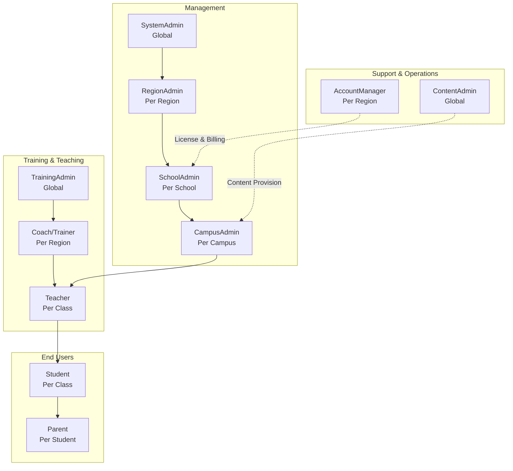
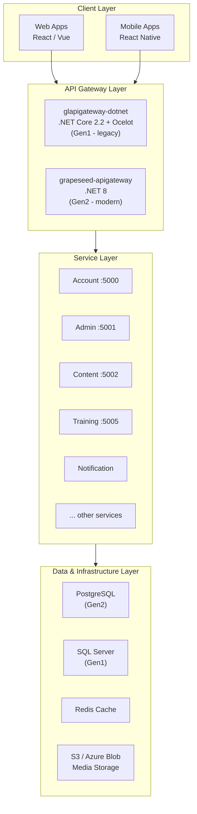
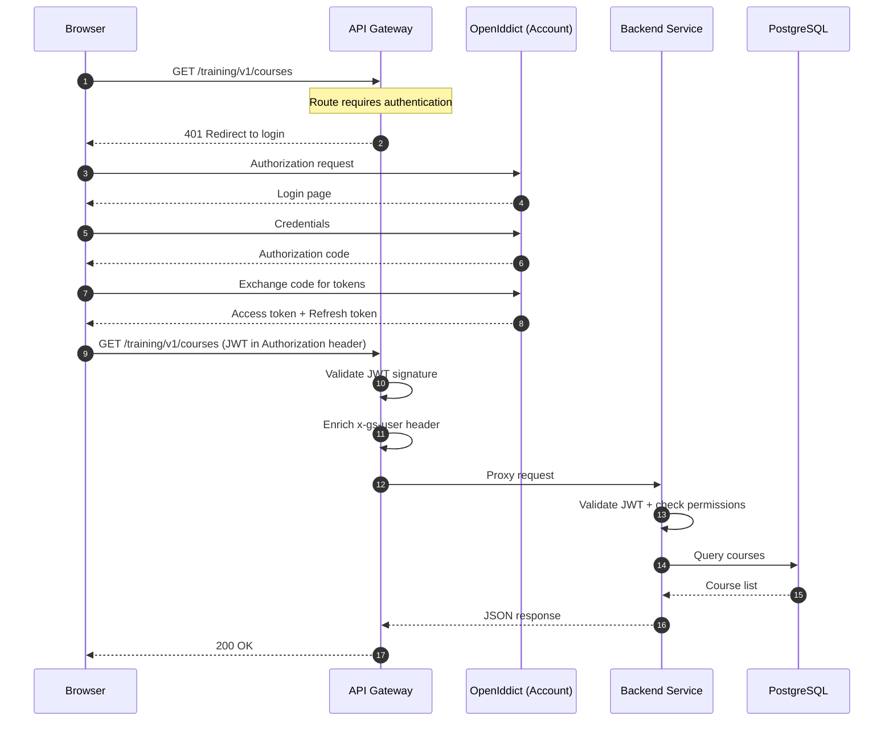
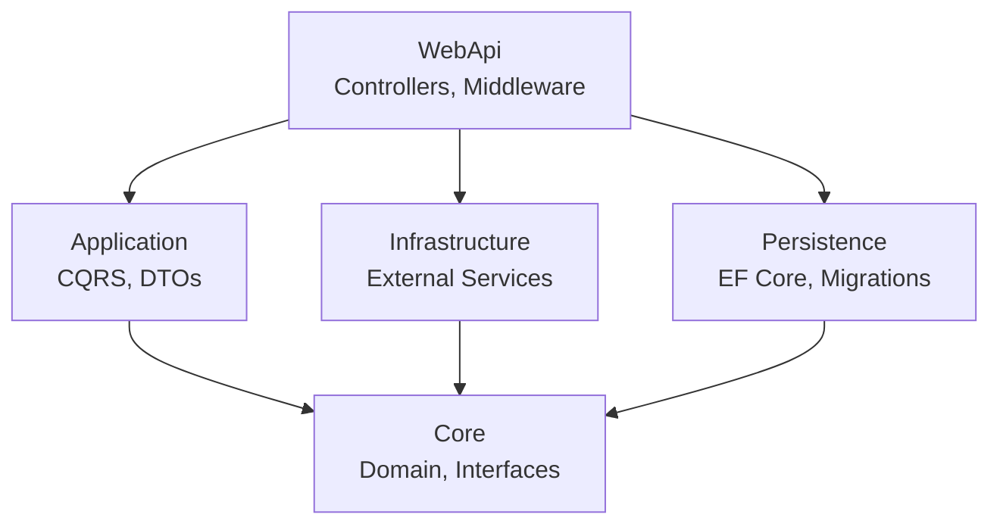
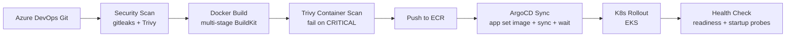

# GrapeSeed — Hướng dẫn Onboarding cho BE Developer

## Mục lục

- [1. Tổng quan GrapeSeed (Business Domain Overview)](#1-tổng-quan-grapeseed-business-domain-overview)
  - [1.1 Giới thiệu sản phẩm](#11-giới-thiệu-sản-phẩm)
  - [1.2 Business modules](#12-business-modules)
  - [1.3 Actors & roles](#13-actors--roles)
  - [1.4 Architecture overview](#14-architecture-overview)
- [2. System Architecture](#2-system-architecture)
  - [2.1 Kiến trúc tổng thể](#21-kiến-trúc-tổng-thể)
  - [2.2 API Gateway](#22-api-gateway)
  - [2.3 Service Catalog](#23-service-catalog)
  - [2.4 Authentication & Authorization](#24-authentication--authorization)
  - [2.5 Inter-service Communication](#25-inter-service-communication)
  - [2.6 Multi-region & Multi-language](#26-multi-region--multi-language)
- [3. Backend Architecture Patterns](#3-backend-architecture-patterns)
  - [3.1 Clean Architecture (Gen2)](#31-clean-architecture-gen2)
  - [3.2 Seed Engine & Autofac Dependency Injection](#32-seed-engine--autofac-dependency-injection)
  - [3.3 CQRS with MediatR](#33-cqrs-with-mediatr)
  - [3.4 Gen1 vs Gen2 Comparison](#34-gen1-vs-gen2-comparison)
  - [3.5 Common Patterns](#35-common-patterns)
  - [3.6 Caching Strategy](#36-caching-strategy)
  - [3.7 Multi-tenant Implementation](#37-multi-tenant-implementation)
- [4. Data Layer & Infrastructure](#4-data-layer--infrastructure)
  - [4.1 Database Landscape](#41-database-landscape)
  - [4.2 Caching](#42-caching)
  - [4.3 Messaging & Queue](#43-messaging--queue)
  - [4.4 Storage](#44-storage)
  - [4.5 CI/CD Pipeline](#45-cicd-pipeline)
  - [4.6 Kubernetes Infrastructure](#46-kubernetes-infrastructure)
  - [4.7 Observability](#47-observability)
- [5. Development Guide](#5-development-guide)
  - [5.1 Environment Setup Checklist](#51-environment-setup-checklist)
  - [5.2 Repository Layout](#52-repository-layout)
  - [5.3 Chạy Local](#53-chạy-local)
  - [5.4 Common Development Tasks](#54-common-development-tasks)
  - [5.5 Testing](#55-testing)
  - [5.6 Workflow](#56-workflow)

---

# 1. Tổng quan GrapeSeed (Business Domain Overview)

## 1.1 Giới thiệu sản phẩm

GrapeSEED là chương trình giáo dục tiếng Anh dành cho trẻ em (early childhood education) được triển khai tại hơn 10 quốc gia bao gồm US, China, Korea, Japan, Russia, và Vietnam. Sản phẩm cung cấp nền tảng quản lý đào tạo (LMS) và vận hành trường học cho hàng nghìn trường mầm non và tiểu học trên toàn cầu.

Hệ thống phần mềm đang trong quá trình chuyển đổi từ thế hệ cũ sang thế hệ mới:

- **GrapeLEAF (Gen1)** — Legacy system viết bằng .NET Core 2.2 / 3.1, sử dụng SQL Server và IdentityServer4. Đây là hệ thống đang vận hành production cho phần lớn khách hàng hiện tại.
- **Grapeseed (Gen2)** — Hệ thống hiện đại viết bằng .NET 8, sử dụng PostgreSQL, OpenIddict, Clean Architecture và CQRS. Đang dần thay thế Gen1.

Lý do migration: IdentityServer4 không còn được maintain và bảo mật hỗ trợ, kiến trúc N-tier của Gen1 khó mở rộng và bảo trì, đồng thời chi phí SQL Server cao hơn PostgreSQL trên cloud. Gen2 được thiết kế lại từ đầu với kiến trúc sạch, dễ maintain và scale.

> **Lưu ý:** Khi đọc code hoặc tài liệu cũ, bạn sẽ thấy cả hai tên "GrapeLEAF" và "Grapeseed" được dùng song song. Nếu gặp code .NET Core 2.2/3.1 với IdentityServer4 thì đó là Gen1; .NET 8 với OpenIddict là Gen2.

## 1.2 Business modules

Hệ thống gồm 8 domain module chính:

1. **Organization** — Quản lý hệ thống phân cấp tổ chức: Region → School → Campus → SchoolClass. Hỗ trợ quy trình change management (phê duyệt thay đổi thông tin trường/lớp).

2. **Training / LMS** — Xây dựng và phân phối lộ trình học tập: Course → Version → Series → Group → Content. Includes learning content player, progress tracking, badge và certification.

3. **Student Management** — Enrollment (ghi danh), quản lý subscription (TextBook / Digital / Dual), promotion (lên lớp), và linking với phụ huynh.

4. **Admin Operations** — License & billing, material ordering (đặt mua giáo trình in), visitation (dự giờ - quality assurance), survey.

5. **Notification** — Hệ thống thông báo đa kênh (Portal / Email / SMS) với multi-language template engine. Sử dụng AWS SQS pipeline để xử lý bất đồng bộ, Quartz scheduled jobs cho các tác vụ định kỳ.

6. **Account & Auth** — OpenIddict OIDC server xác thực tập trung, quản lý user profile, invitation codes cho role-based access.

7. **Content** — Media asset management, video encoding qua Azure Media Services, phân phối nội dung tĩnh qua AWS S3 + CloudFront CDN.

8. **Remote Teaching** — Virtual classroom thời gian thực: Agora RTC cho video/audio, Ably cho presence và spaces (quản lý phòng học ảo).

## 1.3 Actors & roles

| Actor | Scope | Responsibilities |
|-------|-------|------------------|
| SystemAdmin | Global | System configuration, manage regions, user permissions |
| RegionAdmin | Per region | Manage schools, approve organizational changes in region |
| SchoolAdmin | Per school | Manage campuses, teachers, classes |
| CampusAdmin | Per campus | Manage classes, students, materials distribution |
| Teacher | Per class | Teach, manage class activities, receive visitation |
| Coach/Trainer | Per region | Conduct visitations (dự giờ), review & coach teachers |
| TrainingAdmin | Global | Manage training programs, publish course versions |
| AccountManager | Per region | Manage licensing, billing, contracts |
| ContentAdmin | Global | Manage media assets, video content, curriculum materials |
| Parent | Per student | Monitor child progress, receive notifications |
| Student | Per class | Access learning content via student portal / mobile app |



## 1.4 Architecture overview

Ở mức tổng quan, GrapeSeed áp dụng kiến trúc Client-Server phân tầng: **Client Layer** (Web App / Mobile App) gửi request qua **API Gateway Layer**, gateway chịu trách nhiệm routing, JWT validation và rate limiting trước khi chuyển tiếp đến **Backend Services** (các .NET microservices). Mỗi service sở hữu database riêng (database-per-service pattern) — Gen1 dùng SQL Server, Gen2 dùng PostgreSQL. Giao tiếp giữa các service được thực hiện qua HTTP synchronous (gateway pattern với Refit) hoặc async message queue (AWS SQS, Kafka). Toàn bộ hệ thống chạy trên Kubernetes cluster (EKS) và được deploy qua ArgoCD với Docker multi-stage builds.

Xem chi tiết tại [Section 2: System Architecture](#2-system-architecture).

---

> Để tìm hiểu sâu hơn về business domain, tham khảo các tài liệu BRD tại `docs/superpowers/specs/` hoặc liên hệ team để được cấp quyền truy cập Confluence space của dự án.

# 2. System Architecture

Phần này đi sâu vào kiến trúc kỹ thuật của GrapeSeed — từ tổng quan các tầng (layers), gateway, danh sách services, cơ chế xác thực, giao tiếp giữa các service, cho đến multi-region và multi-language. Mục tiêu là giúp bạn hiểu hệ thống được tổ chức thế nào trước khi đi vào chi tiết từng pattern.

## 2.1 Kiến trúc tổng thể

GrapeSeed áp dụng kiến trúc microservice phân tầng (layered architecture) với 4 tầng chính:

1. **Client Layer** — Gồm các web application (React/Vue) và mobile application (React Native). Đây là nơi người dùng cuối tương tác trực tiếp — portal của admin/teacher, student web, parent web, và các mobile app cho phụ huynh và học sinh.

2. **API Gateway Layer** — Single entry point duy nhất cho tất cả request từ client. Gateway chịu trách nhiệm routing request đến đúng downstream service, xác thực JWT, rate limiting, và logging. Hệ thống đang vận hành song song hai gateway: Gen1 (glapigateway-dotnet) và Gen2 (grapeseed-apigateway).

3. **Service Layer** — Tập hợp các .NET microservices, mỗi service đảm nhiệm một domain cụ thể (Account, Admin, Training, Content, Notification,...). Mỗi service sở hữu database riêng (database-per-service), không share database với service khác.

4. **Data & Infrastructure Layer** — Bao gồm database (PostgreSQL cho Gen2, SQL Server cho Gen1), Redis cache, và blob storage (S3 / Azure Blob) cho media assets. Mỗi region có database và storage riêng biệt.

Luồng request cơ bản: Client gửi request đến Gateway → Gateway xác thực, kiểm tra rate limit, enrich headers → chuyển tiếp đến service tương ứng → Service xử lý nghiệp vụ, truy vấn database → Trả response qua Gateway về Client.



## 2.2 API Gateway

API Gateway là điểm vào duy nhất cho tất cả request — không có client nào gọi trực tiếp vào backend service. Gateway đảm nhận các nhiệm vụ sau:

**Reverse proxy (Ocelot routing):** Gateway sử dụng Ocelot (Gen1 và Gen2) để định tuyến request từ đường dẫn public đến đúng downstream service dựa trên cấu hình route — ví dụ `/training/v1/*` được route đến training service port 5005.

**JWT validation:** Gateway xác thực token bằng public key lưu trong file `jwt.cer`. Nếu token hết hạn hoặc không hợp lệ, gateway trả về 401 Unauthorized trước khi request đến được service.

**Rate limiting:** Sử dụng AspNetCoreRateLimit middleware giới hạn số request từ mỗi client IP. Khi vượt ngưỡng, gateway trả về HTTP 429 Too Many Requests.

**API key validation:** Một số internal endpoints yêu cầu API key được sign bằng MD5 checksum, đảm bảo chỉ các caller được ủy quyền mới gọi được.

**Request logging:** Tất cả request/response được log qua Serilog và gửi đến Application Insights để monitoring và debug.

Hệ thống đang vận hành hai gateway song song:

| | glapigateway-dotnet (Gen1) | grapeseed-apigateway (Gen2) |
|---|---|---|
| Framework | .NET Core 2.2 | .NET 8 |
| Router | Ocelot 13 | Ocelot / YARP |
| Trạng thái | Legacy, đang dần thay thế | Modern, tiếp tục phát triển |

**Middleware pipeline thứ tự thực thi (từ ngoài vào trong, top to bottom):**

1. Exception Handler — Bắt tất cả exception, trả về response lỗi chuẩn
2. CORS — Cho phép cross-origin request từ web apps
3. Diagnostic Logging — Ghi log request/response
4. Configuration Load — Load cấu hình động (region-specific, feature flags)
5. IP Rate Limiting — Kiểm tra rate limit theo IP
6. JWT Authentication — Xác thực token JWT bằng public key
7. API Key Validation — Kiểm tra API key cho internal endpoints
8. Ocelot Proxy — Forward request đến downstream service

Khi request đi qua gateway, Authorization header được transform: JWT token được giữ lại, gateway thêm `jwt-authorization` header và header `x-gs-user` chứa thông tin user claims (userId, roles, tenant) trước khi forward đến downstream service. Điều này giúp service không cần tự parse JWT mỗi lần — thông tin user đã có sẵn dưới dạng enrich sẵn.

## 2.3 Service Catalog

Danh sách đầy đủ backend services chia theo thế hệ:

| Service | Path | Gen | Framework | DB | Auth | Chức năng |
|---|---|---|---|---|---|---|
| glas | BE/glas/ | Gen1 | .NET Core 3.1 | SQL Server | IdentityServer4 | Legacy monolith |
| grapeseed-account | BE/grapeseed-account/ | Gen2 | .NET 8 | PostgreSQL | OpenIddict (server) | OIDC, user profile |
| grapeseed-admin | BE/grapeseed-admin/ | Gen2 | .NET 8 | PostgreSQL | JWT Bearer | Admin portal API |
| grapeseed-training | BE/grapeseed-training/ | Gen2 | .NET 8 | PostgreSQL | JWT Bearer | LMS, courses |
| grapeseed-content | BE/grapeseed-content/ | Gen2 | .NET 8 | PostgreSQL | JWT Bearer | Content management |
| grapeseed-notification-service | BE/.../ | Gen2 | .NET 8 | PostgreSQL | JWT Bearer | Notification API |
| grapeseed-notification-worker | BE/.../ | Gen2 | .NET 8 | PostgreSQL | — | Background message consumer |
| admin-service | BE/admin-api/ | Gen1 | .NET Core 2.2 | SQL Server | Custom | Legacy admin |
| content-service | BE/content-service/ | Gen1 | .NET Core 3.1 | SQL Server | — | Legacy content |
| training-service | BE/training-service/ | Gen1 | .NET Core | SQL Server | — | Legacy training |
| studentrep-service | BE/studentrep-service/ | Gen1 | .NET Core | SQL Server | — | Student reporting |
| report-service | BE/report-service/ | Gen1 | .NET Core | SQL Server | — | Reporting |
| grapeseed-student-service | BE/.../ | Gen2 | .NET 8 | PostgreSQL | JWT Bearer | Student management |
| nexus-service | BE/nexus-service/ | Gen2 | .NET 8 | PostgreSQL | JWT Bearer | Nexus API |
| remote-teaching-service | BE/remote-teaching-service/ | Gen2 | .NET 8 | PostgreSQL | JWT Bearer | Virtual classroom |
| function-app-azure | BE/function-app-azure/ | Gen2 | .NET 8 | — | — | Azure Functions |
| grapeseed-apigateway | BE/grapeseed-apigateway/ | Gen2 | .NET 8 | — | — | New API gateway |
| glapigateway-dotnet | BE/glapigateway-dotnet/ | Gen1 | .NET Core 2.2 | — | JWT | Legacy gateway |

## 2.4 Authentication & Authorization

Cơ chế xác thực của GrapeSeed khác nhau giữa hai thế hệ:

**Gen1 (GrapeLEAF):** Sử dụng IdentityServer4 làm OIDC server embedded trong monolith glas. Authentication dùng ASP.NET Identity với cookie-based authentication — user login qua MVC form, IdentityServer4 tạo cookie session. Các request sau đó dùng cookie để xác thực. IdentityServer4 không còn được maintain (end of life) — đây là lý do chính để migrate lên Gen2.

**Gen2 (Grapeseed):** Sử dụng OpenIddict làm OIDC server, chạy như một service riêng (grapeseed-account). Downstream services dùng JWT Bearer authentication — stateless, không cần session. Web apps dùng Authorization Code Flow (OAuth 2.0): browser redirect đến OpenIddict authorize endpoint, user login, nhận authorization code, sau đó exchange code lấy access token + refresh token.

**Luồng xác thực chi tiết (Gen2):**

1. Browser gửi request đến Gateway để truy cập resource cần authentication
2. Gateway phát hiện request chưa có token → redirect 401 đến OpenIddict login page
3. User nhập credentials, OpenIddict xác thực → trả về authorization code
4. Browser exchange authorization code lấy access token + refresh token
5. Browser gọi lại API với JWT trong Authorization header
6. Gateway nhận request, validate JWT signature bằng public key từ file `jwt.cer`
7. Gateway enrich thêm header `x-gs-user` (userId, roles, tenant info) → forward đến service
8. Service nhận request, validate JWT lại (double-check), kiểm tra role permissions
9. Service xử lý nghiệp vụ và trả response



## 2.5 Inter-service Communication

GrapeSeed hỗ trợ hai cơ chế giao tiếp giữa các services: synchronous (HTTP) và asynchronous (message queue).

**Synchronous communication — Gateway pattern với Refit:**

Mỗi service wrapping HTTP call đến service khác qua một interface (đặt tên `IXxxClient` hoặc `IXxxService`). Implementation của interface này dùng Refit — thư viện .NET biến HTTP API thành interface method gọi qua code.

Ví dụ: Training service cần gọi Admin service để lấy thông tin school. Training service định nghĩa interface `IAdminClient` với method `GetSchoolByIdAsync()`. Implementation qua Refit tự động tạo HTTP request đến Admin service. Caller (training service) không cần biết implementation là HTTP, gRPC hay in-process — chỉ gọi interface.

Pattern này mang lại ba lợi ích chính:
- Caller không phụ thuộc vào implementation — dễ đổi transport nếu cần
- Dễ dàng mock interface trong unit tests
- Tập trung error handling, logging, retry logic (Polly) ở một chỗ

Quy tắc quan trọng: **Services không bao giờ truy cập trực tiếp database của service khác** — mọi giao tiếp đều qua public API của service sở hữu dữ liệu.

**Asynchronous communication — Message queues:**

- **AWS SQS:** Notification worker sử dụng 3 SQS queues (PortalNotification, Email, SMS) + 3 DLQs cho mỗi queue. Worker consume message theo long-polling pattern, xử lý và gửi notification qua các kênh tương ứng.
- **Apache Kafka:** Event streaming giữa các services qua Strimzi operator trên Kubernetes (KRaft mode, 2-replica cluster). Kafka được dùng cho các event cần broadcast đến nhiều consumer (ví dụ: user created → notification service gửi welcome email, audit service ghi log).
- **Azure Queue / Service Bus:** Legacy messaging, đang dần được migrate sang SQS/Kafka.

## 2.6 Multi-region & Multi-language

GrapeSeed là hệ thống global — deploy ở nhiều region, mỗi region có database và storage riêng biệt:

| Region | Cloud | Deployment |
|--------|-------|------------|
| ap-southeast-1 | AWS (Singapore) | Primary region |
| us-east-1 | AWS (US East) | US customers |
| cn-northwest-1 | AWS (China, Ningxia) | China customers |
| Yandex Cloud | Russia | Russia customers |

Mỗi region là một deployment độc lập: có database PostgreSQL cluster riêng, Redis cache riêng, blob storage riêng. Cấu hình region-specific lưu trong `appsettings.{region}.json` — connection string, storage account, region code. Ngoài ra mỗi service còn có `appsettings.{env}.json` cho environment-specific (dev/test/prod).

**Hệ thống hỗ trợ 13+ ngôn ngữ:**

en, zh-Hans (Chinese Simplified), vi (Vietnamese), mn (Mongolian), ru (Russian), ko (Korean), ja (Japanese), ms (Malay), es (Spanish), ar-SA (Arabic), th (Thai), my (Myanmar/Burmese), km (Khmer/Cambodian).

Cơ chế localization hoạt động qua request culture provider — hệ thống xác định ngôn ngữ theo thứ tự ưu tiên:
1. Cookie `culture` — do người dùng chọn trong settings
2. `Accept-Language` header — từ trình duyệt
3. Query string `?culture=vi-VN` — cho phép override tạm thời
4. Mặc định theo region của school

Tài nguyên dịch (resource files .resx) được quản lý tập trung và deploy cùng mỗi service. Các message notification (email/SMS) sử dụng template engine hỗ trợ multi-language rendering — cùng một notification template được render ra ngôn ngữ phù hợp dựa trên locale của người nhận.
---

# 3. Backend Architecture Patterns

Phần này dành cho những pattern kiến trúc mà bạn sẽ làm việc hàng ngày với tư cách BE developer trên Gen2 — Clean Architecture, Seed Engine & Autofac DI, CQRS với MediatR, và các common patterns xuyên suốt hệ thống.

## 3.1 Clean Architecture (Gen2)

GrapeSeed Gen2 áp dụng Clean Architecture với 5 layers phân tách rõ ràng. Chiều dependency đi từ ngoài vào trong — layer trong cùng (Core) không biết gì về layer ngoài:

```
WebApi → Application → Infrastructure / Persistence → Core
```

**Core (trung tâm):** Chứa domain entities, enums, interfaces (IRepository, IUnitOfWork). Đây là layer quan trọng nhất vì nó định nghĩa business contracts và domain logic. Core **zero external dependencies** — không reference package nào ngoài MediatR và FluentValidation. Mọi thay đổi ở business requirement đều bắt đầu từ Core.

**Application:** Chứa CQRS commands/queries, DTOs, AutoMapper profiles, và application service interfaces. Layer này chỉ phụ thuộc vào Core. Đây là nơi orchestrate business flow — handler gọi repository thông qua interface, không biết implementation là EF Core, Dapper hay gì khác.

**Infrastructure:** Implement các external service interface — Refit HTTP clients, AWS S3 storage, Redis cache (EasyCaching), email/SMS providers, Polly resilience policies. Chỉ phụ thuộc vào Core. Khi cần thay đổi cloud provider (ví dụ từ S3 sang Azure Blob), chỉ cần sửa infrastructure layer.

**Persistence:** Tầng chịu trách nhiệm lưu trữ — EF Core DbContext, entity type configurations, migrations, interceptors (audit logging, tenant filter). Chỉ phụ thuộc vào Core. Persistence implement các interface repository do Core định nghĩa — Core không biết đến sự tồn tại của EF Core.

**WebApi:** Lớp ngoài cùng — Controllers, middleware, startup configuration. Orchestrates tất cả các layer bên dưới. Đây là entry point duy nhất của ứng dụng.



**Nguyên tắc cốt lõi: Dependency Inversion** — Core không reference bất kỳ layer ngoài nào. Ví dụ: Core định nghĩa interface `ICourseRepository`, Persistence cài đặt nó bằng `EfCourseRepository` dùng EF Core. Ở runtime, WebApi inject implementation qua DI container — Core không hề biết EF Core tồn tại.

Lợi ích thực tế:
- **Testability**: Core và Application có thể unit test dễ dàng — chỉ cần mock interface, không cần DB thật
- **Swapability**: Đổi ORM, cloud provider, cache provider mà không ảnh hưởng business logic
- **Parallel development**: Contract qua interface từ sớm — frontend và backend team làm việc độc lập

## 3.2 Seed Engine & Autofac Dependency Injection

Gen2 sử dụng **Seed Engine pattern** — một auto-discovery DI engine chạy trên Autofac. Pattern này xuất hiện ở mọi Gen2 service.

**Cách hoạt động:**

1. `Startup.cs` gọi `EngineContext.Create<AppWebApiEngine>()` để khởi tạo engine
2. Engine tạo Autofac `ContainerBuilder` và cấu hình scan assemblies
3. `AppTypeFinder` scan tất cả assemblies trong solution, tìm class implement `IAppStartup` (gọi `ConfigureServices`) và `IDependencyRegistration` (gọi `Register`)
4. MediatR handlers và validators được auto-register qua `MediatR.Extensions.Autofac.DependencyInjection`
5. Engine trả về `AutofacServiceProvider` — ASP.NET Core dùng nó làm service provider

```csharp
public class Startup
{
    public IServiceProvider ConfigureServices(IServiceCollection services)
    {
        var engine = EngineContext.Create<AppWebApiEngine>();
        engine.Initialize(services, DefaultFileProvider.Instance, Configuration);
        return engine.ConfigureServices(services, Configuration);
    }
}
```

**IDependencyRegistration pattern:**

```csharp
public class MyServiceRegistration : IDependencyRegistration
{
    public int Order => 0;

    public void Register(
        ContainerBuilder builder,
        ITypeFinder typeFinder,
        AppConfiguration config)
    {
        builder.RegisterType<MyService>()
               .As<IMyService>()
               .InstancePerLifetimeScope();
    }
}
```

Chỉ cần tạo class implement `IDependencyRegistration`, Seed Engine tự động scan và register — không cần sửa `Startup.cs` cho mỗi service mới.

**Tại sao Autofac thay vì Microsoft DI?**

| Tính năng | Microsoft DI | Autofac |
|-----------|-------------|---------|
| Assembly scanning | ✗ Không hỗ trợ | ✓ Built-in |
| Property injection | ✗ | ✓ |
| Interceptors (AOP) | ✗ | ✓ + Castle DynamicProxy |
| Module registration | ✗ | ✓ |
| Named/Keyed services | ✗ | ✓ |
| Lifetime management | Cơ bản | Advanced (LifetimeScope, Owned) |

Gen2 tận dụng auto-discovery của Autofac qua `IDependencyRegistration` — khi bạn thêm một service class mới và implement interface này, nó tự động được registered mà không cần config. Điều này giúp giảm thiểu boilerplate và lỗi quên register dependency.

Pipeline behaviors (validation, performance logging, exception handling) cũng được register qua Autofac modules — xem chi tiết ở mục 3.3.

## 3.3 CQRS with MediatR

GrapeSeed Gen2 áp dụng CQRS pattern qua MediatR library. Tách biệt rõ ràng giữa command (ghi) và query (đọc).

**Commands** — dùng cho mutations (Create/Update/Delete):

```csharp
public interface IRequest<Result<T>>  // Command base
```

**Queries** — dùng cho reads (có phân trang):

```csharp
public interface IRequest<Result<PaginatedItemsResult<T>>>  // Query base
```

**Handlers** — mỗi command/query có một handler riêng:

```csharp
public class Handler : IRequestHandler<TCommand, TResult>
```

**Ví dụ Command + Handler:**

```csharp
// Command
public class CreateCourseCommand : IRequest<Result<Guid>>
{
    public string Name { get; set; }
    public string Description { get; set; }
}

// Handler
public class CreateCourseHandler : IRequestHandler<CreateCourseCommand, Result<Guid>>
{
    private readonly IUnitOfWork _uow;

    public async Task<Result<Guid>> Handle(CreateCourseCommand request, CancellationToken ct)
    {
        var course = new Course(request.Name, request.Description);
        _uow.Courses.Add(course);
        await _uow.SaveChangesAsync(ct);
        return Result.Ok(course.Id);
    }
}
```

Khi handler nhận `CreateCourseCommand`, nó tạo domain entity `Course`, dùng `IUnitOfWork` để thêm vào repository và save. Transaction được quản lý tự động bởi pipeline — `SaveChangesAsync` nằm trong handler nhưng transaction wrap ở pipeline level.

**Pipeline Behaviors** (registered trong `RegistrationExtensions.cs`):

| Behavior | Vai trò |
|----------|---------|
| `ValidationBehavior` | Auto-validate request bằng FluentValidation trước khi handler chạy. Nếu validation fail → 400 Bad Request, handler không bao giờ chạy. |
| `PerformanceBehavior` | Log execution time của mỗi command/query. Cảnh báo nếu vượt ngưỡng (thường > 500ms). |
| `UnhandledExceptionBehavior` | Catch tất cả exception không được xử lý trong handler, log chi tiết (stack trace, request data). Trả về 500 với mã lỗi tracking. |
| `ResponseHandlingBehavior` | Wrap response trong `ApiResult<T>` format chuẩn (success flag, error code, message). |

**Luồng thực thi pipeline:**

```
Request → ValidationBehavior → PerformanceBehavior → Handler → ResponseHandlingBehavior → Response
                                                         ↓ (nếu exception)
                                              UnhandledExceptionBehavior
```

Transaction flow: `ResponseHandlingBehavior` mở transaction trước khi gọi handler. Nếu handler thành công → commit. Nếu handler throw exception → rollback. Điều này đảm bảo tính toàn vẹn dữ liệu — nếu một command ghi vào nhiều entity, tất cả được commit hoặc rollback trong một transaction.

## 3.4 Gen1 vs Gen2 Comparison

| Aspect | Gen1 (GrapeLEAF) | Gen2 (Grapeseed) |
|--------|-------------------|-------------------|
| .NET | Core 2.2 / 3.1 | 8.0 |
| Architecture | N-tier (Controllers → Services → Repositories → DB) | Clean Architecture (Core → Application → Infrastructure/Persistence → WebApi) |
| DI | Autofac (manual ContainerBuilder) | Autofac + Seed Engine (auto-discovery) |
| Auth | IdentityServer4 + cookies | OpenIddict + JWT Bearer |
| DB | SQL Server | PostgreSQL |
| CQRS | ✗ | MediatR |
| Caching | Custom ICacheManager | EasyCaching + Redis |
| Resilience | None | Polly + retry policies |
| API Versioning | ✗ | Asp.Versioning.Mvc |
| Health Checks | Basic /health | AspNetCore.HealthChecks (NpgSql, Redis, S3) |
| Serialization | Newtonsoft.Json | System.Text.Json |

**Lý do migration (1 câu mỗi mục):**

- **.NET 8.0**: Tận dụng runtime performance improvements, Native AOT support, và LTS mới nhất — .NET Core 2.2/3.1 đã hết support.
- **Clean Architecture**: N-tier tight coupling khiến thay đổi business logic ảnh hưởng đến DB layer — Clean Architecture đảo ngược dependency để business độc lập với infrastructure.
- **Seed Engine**: Auto-discovery loại bỏ manual registration — giảm lỗi quên register và boilerplate khi thêm service mới.
- **OpenIddict + JWT**: IdentityServer4 end-of-life, JWT Bearer stateless authentication scale tốt hơn cookie trong microservice environment.
- **PostgreSQL**: Chi phí license thấp hơn SQL Server, hỗ trợ JSONB tốt, open-source ecosystem mạnh, hiệu suất tương đương trên cloud workload.
- **MediatR CQRS**: Tách biệt read/write model giúp code dễ maintain, mỗi command/query là một class riêng — single responsibility.
- **EasyCaching + Redis**: Provider pattern cho phép đổi cache backend (Redis, in-memory, Memcached) mà không ảnh hưởng business code.
- **Polly**: HTTP call giữa services không thể thiếu retry và circuit breaker — Gen2 xử lý lỗi network/resilience một cách systematic.
- **Asp.Versioning.Mvc**: Hỗ trợ versioning API chính thức — breaking change không làm ảnh hưởng client cũ.
- **AspNetCore.HealthChecks**: Health check chuyên sâu từng dependency (DB, Redis, S3) — Gen1 chỉ check app alive hay không.
- **System.Text.Json**: Built-in, zero-dependency, performance cao hơn Newtonsoft.Json — giảm memory allocation trên mỗi serialization.

## 3.5 Common Patterns

**Gateway pattern (Refit HTTP clients):**

Mỗi service wrapping HTTP calls đến service khác qua interface — đặt tên `IXxxClient` (ví dụ `IAdminClient`, `ITrainingClient`). Implementation dùng Refit — thư viện code-gen HTTP client từ interface C#:

```csharp
public interface IAdminClient
{
    [Get("/api/v1/schools/{schoolId}")]
    Task<SchoolDto> GetSchoolByIdAsync(Guid schoolId, CancellationToken ct);
}
```

Ba lợi ích chính: (1) Caller không biết transport — có thể đổi từ HTTP sang gRPC mà không sửa business code; (2) Dễ mock trong unit tests — chỉ cần mock interface; (3) Centralized error handling — Polly policies, logging, retry config ở một chỗ.

Mỗi service có extension method `RegisterGatewayServices` để register tất cả gateway clients vào DI container.

**Unit of Work + Repository pattern:**

```csharp
public interface IUnitOfWork : IDisposable
{
    ICourseRepository Courses { get; }
    IEnrollmentRepository Enrollments { get; }
    Task<int> SaveChangesAsync(CancellationToken ct = default);
}
```

EF Core `DbContext` tự nhiên implement Unit of Work pattern — mỗi `DbSet<T>` là một repository. `SaveChangesAsync` commit tất cả changes trong một transaction. Trong business code, handler chỉ gọi `_uow.Courses.Add(course)` và `_uow.SaveChangesAsync()` — không bao giờ gọi DbContext trực tiếp.

**FluentValidation + Pipeline Behavior:**

Validation rules được định nghĩa trong class riêng, tách biệt khỏi handler:

```csharp
public class CreateCourseValidator : AbstractValidator<CreateCourseCommand>
{
    public CreateCourseValidator()
    {
        RuleFor(x => x.Name).NotEmpty().MaximumLength(200);
        RuleFor(x => x.Description).MaximumLength(2000);
    }
}
```

`ValidationBehavior` trong MediatR pipeline auto-run validator trước khi handler — validation fail → trả về 400 Bad Request, handler không bao giờ chạy. Không cần check `ModelState.IsValid` trong controller.

**Polly resilience pipeline:**

HTTP calls giữa services được wrap bởi Polly policies:
- **Retry**: Exponential backoff (2s, 4s, 8s) cho transient failures (HTTP 5xx, timeout)
- **Circuit breaker**: Ngưng gọi service đang lỗi sau N lần fail liên tiếp, tự động thử lại sau timeout
- **Timeout**: Giới hạn thời gian chờ response — tránh thread pool starvation

Cấu hình resilience policies tập trung trong `DependencyRegistration` — không rải rác trong business code.

## 3.6 Caching Strategy

**EasyCaching (Redis) — Distributed cache:**

Gen2 sử dụng EasyCaching library làm abstraction layer cho distributed caching. Provider pattern cho phép switch giữa Redis, in-memory, Memcached mà không ảnh hưởng business code. Hiện tại production dùng Redis backend.

```csharp
public interface IEasyCachingProvider
{
    Task<CacheValue<T>> GetAsync<T>(string cacheKey, CancellationToken ct = default);
    Task SetAsync<T>(string cacheKey, T value, TimeSpan expiration);
}
```

**DataProtection keys in Redis:**

ASP.NET Core Data Protection keys được lưu trong Redis — đảm bảo tất cả pods trong Kubernetes cluster dùng chung key để encrypt/decrypt. Nếu app restart, key không bị mất.

**Per-request memory cache:**

Dùng `IMemoryCache` trong scope của một request — data được cache trong suốt vòng đời request nhưng không share giữa các requests. Phù hợp cho computed data cần tính lại mỗi request (ví dụ: permissions).

**Cache-aside pattern:**

```
Application check cache → Hit → Return cached data
                          Miss → Query DB → Set cache → Return data
```

Code minh họa:

```csharp
var cacheKey = $"course:{courseId}";
var cached = await _cache.GetAsync<CourseDto>(cacheKey);
if (cached.HasValue) return cached.Value;

var course = await _uow.Courses.GetByIdAsync(courseId);
var dto = _mapper.Map<CourseDto>(course);
await _cache.SetAsync(cacheKey, dto, TimeSpan.FromMinutes(30));
return dto;
```

Cache expiration tùy theo loại dữ liệu — reference data (ít thay đổi) cache lâu hơn transactional data.

## 3.7 Multi-tenant Implementation

Mỗi region là một tenant riêng biệt với database và blob storage isolation hoàn toàn.

**CountryCodeFilter (Action Filter):**

Attribute gắn trên controller để tự động inject tenant context từ request:

```csharp
[CountryCodeFilter]
[ApiController]
public class CoursesController : ControllerBase
{
    // Request header "x-gs-country" tự động parse → tenant context
}
```

Filter này đọc tenant information từ request header/URL path, set vào `ITenantRequestHeaderService` để business logic ở layer dưới có thể truy cập.

**ITenantRequestHeaderService:**

Service interface cung cấp tenant context trong suốt request pipeline:

```csharp
public interface ITenantRequestHeaderService
{
    string CurrentCountryCode { get; }
    string CurrentRegion { get; }
    Guid? CurrentUserId { get; }
}
```

**Isolation strategy — Database per tenant:**

- Mỗi region có connection string riêng trong `appsettings.{region}.json`
- Mỗi region có database PostgreSQL riêng, blob storage riêng (S3 bucket riêng)
- Connection string được chọn dựa trên country code từ request — không share data giữa các tenants
- Tenant filter (EF Core query filter) tự động áp dụng trên mọi query — đảm bảo developer không quên filter tenant

```json
// appsettings.ap-southeast-1.json
{
  "ConnectionStrings": {
    "PostgreSQL": "Server=pg-sg.region;Database=grapeseed_apse1;..."
  },
  "Storage": {
    "BucketName": "grapeseed-apse1-assets"
  }
}
```

Ưu điểm của database-per-tenant isolation:
- **Security**: Không share data giữa các tenants — lỗi query không thể leak data cross-tenant
- **Performance**: Có thể optimize DB riêng cho từng region (indexing, sizing)
- **Compliance**: Dữ liệu ở China region tuân thủ luật Chinese data sovereignty
- **Maintenance**: Backup/restore từng tenant độc lập — maintenance một region không ảnh hưởng region khác
---

# 4. Data Layer & Infrastructure

Phần này mô tả chi tiết hạ tầng dữ liệu và infrastructure của GrapeSeed — từ database, caching, messaging, storage, CI/CD pipeline cho đến Kubernetes cluster và observability stack.

## 4.1 Database Landscape

GrapeSeed áp dụng **database-per-service pattern**: mỗi service sở hữu database riêng, không share với service khác. Điều này đảm bảo isolation giữa các services và tránh tình trạng coupling không mong muốn. Service chỉ truy cập dữ liệu của service khác qua public API — không bao giờ truy vấn trực tiếp database của service khác.

**Gen1 (GrapeLEAF):** SQL Server với EF Core (database-first). DbContext pool được cấu hình 154–300 connections tùy service. Models được generate từ database schema, phù hợp với N-tier truyền thống.

**Gen2 (Grapeseed):** PostgreSQL với Npgsql provider và EF Core Code First. Entity mapping (IEntityTypeConfiguration) nằm trong Persistence project; Core layer chỉ chứa domain entities thuần — không biết đến DB provider.

**Migrations:** Mỗi service tự quản lý schema riêng qua `dotnet ef migrations add <name>`. Migration files lưu trong `Persistence/Migrations/`. Legacy SQL scripts cho Gen1 đặt tại `BE/sql-scripts/`.

## 4.2 Caching

**Redis (Valkey):** Deployed trên Kubernetes, single instance per environment (dev/test/prod). Đóng vai trò distributed cache layer cho toàn bộ hệ thống.

**EasyCaching — Abstract provider pattern:** Application code không phụ thuộc Redis API — chỉ giao tiếp qua interface `IEasyCachingProvider`. Lợi ích: có thể đổi cache backend (Redis → in-memory → Memcached) mà không sửa business code. Cấu hình provider qua `appsettings.{env}.json`:

```csharp
await _cache.SetAsync("key", data, TimeSpan.FromMinutes(30));
var cached = await _cache.GetAsync<MyData>("key");
```

**Use cases chính:**
- **Session cache:** Distributed session cho web apps — tất cả pods chia sẻ session state
- **OpenIddict token cache:** Lưu authorization codes, access/refresh tokens thay vì database
- **DataProtection keys:** ASP.NET Core Data Protection keys ring — tồn tại qua restart
- **Frequent query cache:** Cache-aside pattern cho reference data, configuration

## 4.3 Messaging & Queue

**AWS SQS:** 3 queues cho async notification delivery — mỗi queue có DLQ riêng:
- **PortalNotification** — In-app notification
- **Email** — Email delivery
- **SMS** — SMS delivery

Worker service (grapeseed-notification-worker) long-poll consume messages, xử lý và gửi notification qua kênh tương ứng. Message fail sau max retry chuyển vào DLQ để debug.

**Apache Kafka via Strimzi:** Event streaming platform trên K8s (KRaft mode, 2-replica cluster). Kafka cho event cần fan-out đến nhiều consumers — ví dụ `UserCreated` → notification service gửi welcome email, audit service ghi log, indexing service update search index.

**Azure Queue / Service Bus:** Legacy — đang dần migrate sang SQS (notification) và Kafka (event streaming). Không dùng cho Gen2 services mới.

## 4.4 Storage

**Azure Blob Storage:** Gen1 media assets — mỗi region có storage account riêng. Dùng cho video lessons, images, curriculum materials.

**AWS S3 + CloudFront CDN:** Gen2 media distribution. S3 là origin storage, CloudFront cung cấp edge caching toàn cầu — assets được cache tại edge locations gần user nhất, giảm latency.

**Video encoding:** Azure Media Services (Gen1). Gen2 đang migrate strategies — upload → encode (multiple resolutions) → store → CDN distribution pipeline.

## 4.5 CI/CD Pipeline

Pipeline CI/CD chuẩn hóa cho tất cả Gen2 services — chạy trên Azure DevOps Pipeline, deploy qua ArgoCD:



**Security Scan:** gitleaks phát hiện secrets bị commit nhầm; Trivy filesystem scan phát hiện vulnerabilities và misconfigurations. Pipeline fail nếu có lỗi CRITICAL.

**Docker Build:** Multi-stage với BuildKit — SDK stage restore NuGet packages từ CodeArtifact (có authentication) → build → publish → chiseled runtime stage (chỉ包含 runtime cần thiết, giảm attack surface).

**Container Scan:** Trivy quét container image sau build. Pipeline fail nếu có lỗi CRITICAL — blocking deployment cho đến khi được fix.

**Push to ECR:** Image tag với commit SHA (ví dụ `grapeseed-account:abc123def`) → push lên Amazon ECR. Git SHA đảm bảo traceability.

**ArgoCD Deploy:** `argocd app set <app> --image <tag>` cập nhật Application CR → sync → wait cho healthy. Nếu rollout fail (CrashLoopBackOff, probes fail), ArgoCD tự động rollback.

## 4.6 Kubernetes Infrastructure

**EKS Multi-cluster:** dev, test, prod, shared clusters — mỗi cluster nằm trong AWS account riêng biệt, đảm bảo isolation hoàn toàn giữa các environments.

**Karpenter:** Node autoscaling với hai nodepool:
- **infra-nodepool:** t3.medium reserved instances cho system components (monitoring, ingress, ArgoCD)
- **apps-nodepool:** Spot + on-demand mix cho application workloads

**ALB Ingress:** Shared ALB group — nhiều services share một ALB qua annotation `group.name`. Internal services (không public) dùng internal ALB riêng, không expose ra internet.

**External Secrets Operator:** Secrets từ AWS Parameter Store. Mỗi app có IAM role riêng với least-privilege permissions (`eks-training-app`, `eks-account-app`, etc.). Operator tự động sync secrets vào Kubernetes Secrets.

**ArgoCD:** GitOps deployment — Application CR trỏ đến Bitbucket repo + Kustomize path. SSO qua Azure AD — developer không cần quản lý ArgoCD credentials riêng.

## 4.7 Observability

**Metrics:** Prometheus Operator thu thập metrics từ tất cả services → Grafana Mimir (multi-tenant: dev-tenant, test-tenant, prod-tenant, shared-tenant). Metrics gồm CPU, memory, request rate, error rate, P50/P95/P99 latency.

**Logs:** Loki (SimpleScalable mode, S3 backend) — structured logging qua Serilog, enrich với correlation ID, tenant context, service name. Query logs qua Grafana Explore.

**Dashboards:** Grafana với Azure AD SSO. Dashboards sẵn có: service health overview, resource utilization, database performance, cache hit ratio, message queue depth.

**Legacy:** Gen1 services dùng Azure Application Insights — đang dần migrate lên Prometheus + Loki stack.

# 5. Development Guide

Phần này cung cấp hướng dẫn thực hành để bạn bắt đầu contribution — từ setup môi trường, hiểu cấu trúc repository, chạy local, thực hiện các tác vụ phát triển hàng ngày, cho đến quy trình testing và workflow.

## 5.1 Environment Setup Checklist

Trước khi clone code, hãy đảm bảo môi trường của bạn đã có đủ các thành phần sau:

- **.NET SDK 8.0.x**: Kiểm tra với `dotnet --version` — phải là 8.0.x (ví dụ 8.0.204). Tải từ [dotnet.microsoft.com](https://dotnet.microsoft.com/download/dotnet/8.0). Gen2 bắt buộc .NET 8, không dùng .NET 9 preview.
- **IDE**:
  - *Visual Studio 2022* (recommended) — khi cài nhớ chọn workload "ASP.NET and web development". VS2022 tích hợp sẵn container tools, git, và debugger mạnh.
  - *JetBrains Rider* — lựa chọn nhẹ hơn, chạy tốt trên macOS và Linux. Nếu team dùng macOS, Rider là lựa chọn phổ biến.
- **Docker Desktop**: Bắt buộc để chạy local PostgreSQL, Redis, và các dependent services qua docker-compose. Mỗi service đều có file `docker-compose.yml` để chạy infrastructure dependencies.
- **AWS CodeArtifact NuGet auth**: Các NuGet packages private được lưu trên AWS CodeArtifact. Cần login trước khi restore:
  ```bash
  aws codeartifact login --tool dotnet --domain grapeseed --repository nuget-store
  ```
  Yêu cầu AWS CLI đã configured với credentials có quyền truy cập CodeArtifact. Nếu chưa có, liên hệ team để được cấp access key.
- **Database**: PostgreSQL 12+ — có thể chạy local qua Docker hoặc dùng remote dev DB. Connection string config trong `appsettings.localtest.json`.

## 5.2 Repository Layout

Toàn bộ codebase nằm trong `D:/Code/GrapeSeed/` với cấu trúc như sau:

```
D:/Code/GrapeSeed/
├── BE/           # Backend — tất cả .NET services
│   ├── grapeseed-account/        # OIDC server + user management
│   ├── grapeseed-admin/          # Admin portal API
│   ├── grapeseed-training/       # LMS / Training
│   ├── grapeseed-content/        # Content management
│   ├── grapeseed-notification-*/ # Notification (service + worker)
│   ├── glas/                     # Legacy Gen1 monolith
│   ├── admin-service/            # Legacy Gen1 admin
│   ├── training-service/         # Legacy Gen1 training
│   ├── k8s-infra/                # Kubernetes manifests
│   ├── grapeseed-terraform/      # Infrastructure-as-Code
│   ├── grapeseed-sql-scripts/    # Legacy DB scripts
│   └── clean-architecture-project-template/  # Template cho service mới
├── FE/           # Frontend — web apps + mobile apps
└── docs/         # Tài liệu
    └── onboarding/               # Tài liệu onboarding (bạn đang đọc)
```

Lưu ý quan trọng: **Đây không phải monorepo** — mỗi service là một solution/project riêng biệt, có pipeline CI/CD và deployment riêng. Bạn không thể build tất cả từ root — cần vào đúng thư mục service để build.

Template cho service mới nằm tại `BE/clean-architecture-project-template/`. Khi được giao tạo service mới, hãy copy template này làm starting point — nó đã có sẵn cấu trúc Clean Architecture, Seed Engine, CQRS pipeline, và Dockerfile.

## 5.3 Chạy Local

Mỗi service đều có `docker-compose.yml` để chạy các infrastructure dependencies (PostgreSQL, Redis, message queues) — không cần cài đặt thủ công từng service:

```bash
docker compose up -d
```

Configuration cho local dev nằm trong `appsettings.localtest.json` — file này override các settings mặc định để trỏ đến localhost (PostgreSQL port 5432, Redis port 6379, etc.). Không sửa `appsettings.json` hay `appsettings.Development.json` cho mục đích local dev.

**Thứ tự chạy:** Luôn chạy **grapeseed-account** trước. Lý do: account service là OIDC server — các service khác dùng nó để authenticate và validate JWT. Nếu account chưa chạy, các service khác sẽ fail ở bước xác thực.

**Cẩn thận NuGet restore:** Private NuGet packages được restore từ AWS CodeArtifact. Nếu chưa login (xem mục 5.1), build sẽ fail với lỗi 401 Unauthorized từ NuGet source. Chạy `dotnet restore` sau khi login để verify.

## 5.4 Common Development Tasks

**Thêm API endpoint mới — quy trình 5 bước:**

1. **Command/Query class** trong Application layer: Nếu là mutation (tạo/sửa/xóa) → tạo Command class implement `IRequest<TResult>`. Nếu là read → tạo Query class implement `IRequest<TResult>` (thường với `PaginatedItemsResult<T>`). Đặt tên theo pattern `{Action}{Entity}Command` / `Get{Entity}Query`.

2. **Handler** implement `IRequestHandler<TCommand, TResult>`: Business logic thuần — gọi repository interface, không gọi DbContext trực tiếp. Handler là nơi duy nhất chứa xử lý nghiệp vụ cho command/query đó.

3. **FluentValidation Validator** (optional): Nếu cần validate input, tạo class kế thừa `AbstractValidator<TCommand>`. Pipeline Behavior tự động chạy validator trước handler — validation fail trả về 400, handler không bao giờ chạy.

4. **Controller method** trong WebApi layer: Tạo action method trong controller tương ứng. Controller chỉ làm nhiệm vụ routing — gọi MediatR `Send()` và trả về response. Không đặt business logic trong controller.

5. **Gateway route** (nếu cần): Nếu service đứng sau API Gateway (hầu hết đều vậy), cần thêm route config trong gateway để request từ client đến được service.

**Thêm EF Core migration:**

```bash
cd Grapeseed.Xxx.Persistence
dotnet ef migrations Add YourMigrationName --context AppDbContext
```

Migration name nên mô tả rõ change: `AddCourseDescriptionField`, `CreateEnrollmentTable`, `AddIndexOnStudentEmail`. Tránh đặt tên chung chung như `UpdateDb` hay `Fix`.

**Thêm feature mới — best practice:**

Luôn theo CQRS pattern. Cách nhanh nhất: tìm feature tương tự nhất trong codebase (cùng module), copy cấu trúc files và điều chỉnh. Một feature điển hình gồm:
- 1 Command/Query class
- 1 Handler class
- (optional) 1 Validator class
- (optional) Controller endpoint

Nếu feature cần gọi API ngoài (third-party service, internal service khác), tạo interface + implementation trong Infrastructure layer. Dùng Refit cho HTTP calls, implement `IDependencyRegistration` để đăng ký vào DI container — Seed Engine tự động scan và register.

## 5.5 Testing

| Type | Framework | Target |
|------|-----------|--------|
| UnitTest | xUnit + Moq + AutoFixture | Business logic, handler logic |
| IntegrationTest | Testcontainers + real DB | API endpoints, DB queries |
| Load Test | K6 | Performance baseline (xem grapeseed-student-service/k6/) |

**Naming convention:**
- Class: `{ClassName}Tests` (vd: `CreateCourseHandlerTests`)
- Method: `{Method}_Should_{Expected}_When_{Condition}` (vd: `Handle_Should_ReturnSuccess_WhenCourseNameIsValid`)

**Pipeline gate:** Pipeline bắt buộc tất cả tests pass trước khi deploy. Unit tests chạy ở giai đoạn `Test`, integration tests chạy sau khi deploy xuống dev environment. Nếu test fail, pipeline dừng và không deploy tiếp.

## 5.6 Workflow

**Git workflow:**
Feature branch từ `main` → commit thường xuyên → push → mở Pull Request → code review → merge (squash commit vào main). Tên branch theo convention: `feature/{short-description}`, `bugfix/{issue-id}-{description}`, `hotfix/{description}`.

**Pipeline gates (thứ tự thực thi):**
1. Security Scan — gitleaks (secrets) + Trivy (vulnerabilities)
2. Build — dotnet build
3. Unit Test — dotnet test
4. Container Scan — Trivy quét Docker image
5. Deploy to Dev — tự động
6. Integration Test — chạy sau deploy dev
7. Deploy to Test — tự động
8. Deploy to Prod — cần manual approval

Nếu bất kỳ gate nào fail, pipeline dừng ngay — không deploy tiếp môi trường sau.

**Code review checklist:**
- Code có đúng spec không? (đúng business requirement)
- Có unit test cho logic mới không? (handler tests, validator tests)
- Error handling đầy đủ chưa? (exception catching, meaningful error messages)
- Performance có vấn đề không? (N+1 queries, missing indexes, không dùng async properly)
- Có follow đúng pattern của project không? (CQRS, Clean Architecture layers, DI registration)
- Security: có leak sensitive data qua response không? (password, tokens, PII)

Ít nhất 1 approver trước khi merge. Đối với thay đổi quan trọng (schema migration, public API change), recommend 2 approvers.
